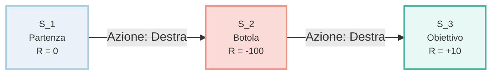

## 1. Il Filo Logico: Dallo Statico al Dinamico

Le **Reti Bayesiane Statiche** nascono con l'obiettivo di calcolare la distribuzione di probabilità di alcune variabili nascoste partendo da un insieme di osservazioni note, utilizzando algoritmi di inferenza come la _Variable Elimination_. 

Questo strumento si rivela di fondamentale importanza quando occorre diagnosticare una causa partendo dagli effetti, ma presenta un limite strutturale invalicabile: scatta una fotografia istantanea del mondo in un singolo istante temporale, ignorando completamente l'evoluzione degli eventi, la storia pregressa e gli sviluppi futuri.

Quando a questo impianto probabilistico si standardizza la necessità di compiere una scelta, si transita verso le **Reti di Decisione Statiche**. Esse integrano la struttura bayesiana con nodi di decisione e nodi di utilità, applicando il principio della Massima Utilità Attesa (MEU) per identificare l'opzione più vantaggiosa. Sebbene questo approccio sia utile per risolvere problemi decisionali immediati e isolati, presuppone implicitamente che il mondo si congeli un istante dopo l'azione, rendendolo inadatto a scenari reali in cui le scelte si susseguono.

Un agente intelligente operante nel mondo reale non si muove all'interno di un'immagine fissa, ma è immerso in un flusso temporale continuo. La transizione verso i modelli dinamici e sequenziali si rende logicamente obbligatoria per tre ragioni concrete:

- **La lungimiranza degli effetti:** Una decisione presa nel momento presente riverbera i suoi effetti sugli stati futuri del sistema, imponendo una pianificazione a "lungo termine" (da capire quanto a lungo).
- **L'imperfezione sensoriale:** I dati estratti dal mondo esterno sono strutturalmente parziali e affetti da rumore; l'agente non disporrà mai di una certezza assoluta sul tempo presente, ma solo di indizi accumulati passo dopo passo.

## 2. Rappresentazione del Tempo: Reti Bayesiane Dinamiche (DBN)

La **Rete Bayesiana Dinamica (DBN)** rappresenta l'estensione matematica necessaria per modellare la probabilità lungo un periodo di tempo. Il sistema provvede a spezzare il tempo continuo in una sequenza di intervalli regolari, definiti fette temporali (_time slices_), indicati con $t, t+1, t+2, \dots$

All'interno di ogni singola fetta temporale convivono stabilmente due macro-categorie di variabili. La prima è costituita dalle variabili nascoste, indicate con $X_t$, che rappresentano lo stato reale e oggettivo del mondo che l'agente non può osservare in modo diretto. La seconda categoria è composta dalle osservazioni, indicate con $E_t$, che racchiudono le evidenze empiriche e i dati dei sensori, per loro natura incompleti o distorti da interferenze ambientali.

Se il sistema dovesse calcolare la probabilità degli stati futuri basandosi sull'intera cronologia delle osservazioni passate, la complessità computazionale crescerebbe in modo esponenziale fino a saturare ogni risorsa di calcolo. Per ovviare a questo problema, le Reti Bayesiane Dinamiche si fondano su due assunzioni cardine che ne rendono sostenibile l'utilizzo:

La prima è l'**Assunzione di Markov del primo ordine**, secondo la quale lo stato futuro del sistema dipende esclusivamente dallo stato immediatamente precedente e non dalla storia remota. In termini formali, il presente racchiude già in sé tutta la memoria storica necessaria a prevedere il domani, semplificando la scrittura probabilistica nel modo seguente:

$$P(X_t \mid X_{0:t-1}) = P(X_t \mid X_{t-1})$$

La seconda è l'**Assunzione di Stazionarietà**, la quale stabilisce che le leggi fisiche e probabilistiche che governano la transizione da uno stato all'altro rimangano costanti nel tempo. Le regole del contesto operativo a $t=1$ rimangono identiche a quelle operanti a $t=100$, garantendo la stabilità dei parametri del modello.

L'operazione fondamentale che si compie all'interno di questo framework prende il nome di **Filtraggio (Filtering)**. Questa procedura consiste nel calcolo continuo dello Stato di Credenza (_Belief State_), e risponde costantemente a un interrogativo fondamentale: determinare la propria posizione attuale nel mondo sulla base di tutta la sequenza di evidenze sensoriali accumulate dall'inizio delle operazioni fino al momento presente. La formula concettuale che esprime questo obiettivo è:

$$P(X_t \mid E_{1:t})$$

## 3. Teoria delle Decisioni Sequenziali: I POMDP

Quando l'architettura delle Reti Bayesiane Dinamiche, deputata alla gestione del tempo e dell'incertezza, si fonde con la teoria delle decisioni basata su azioni e ricompense, si originano i **POMDP (Partially Observable Markov Decision Processes)**, ovvero i Processi Decisionali Markoviani Parzialmente Osservabili.

### I Componenti del POMDP

Un POMDP estende la struttura di un normale processo decisionale replicando nel tempo cinque elementi costitutivi:

- **Stati ($S_t$):** Rappresentano la configurazione reale e oggettiva in cui si trova l'ambiente. Questa informazione è preclusa alla vista diretta dell'agente, ma è matematicamente indispensabile poiché definisce la realtà fisica sottostante con cui l'entità deve interagire.
- **Azioni ($A_t$):** Costituiscono l'insieme di tutte le opzioni operative e le manovre a disposizione dell'agente. La loro utilità risiede nel permettere al sistema di intervenire attivamente sul contesto, modificando l'ambiente circostante per orientarlo verso i propri scopi.
- **Modello di Transizione ($P(S_{t+1} \mid S_t, A_t$)):** Descrive la fisica probabilistica del mondo, specificando la probabilità di approdare a uno stato futuro eseguendo una determinata azione nello stato di partenza. Questo modello è cruciale per gestire il fatto che le azioni reali non sono mai totalmente deterministiche, incorporando l'eventualità di fallimenti meccanici o imprevisti ambientali.
- **Modello di Osservazione ($P(E_t \mid S_t$)):** Definisce il comportamento e il grado di affidabilità dei sensori, esprimendo la probabilità di registrare una specifica lettura data la reale sottomissione a uno stato. Serve a quantificare matematicamente il rumore di fondo, l'errore strumentale e l'ambiguità delle percezioni dell'agente.
- **Funzione di Utilità o Ricompensa ($R(S_t, A_t$)):** Assegna un valore numerico, positivo o negativo, alla combinazione di uno stato e di un'azione. È lo strumento necessario per fornire una direzione e un obiettivo chiaro all'agente, premiando i comportamenti virtuosi e penalizzando severamente le situazioni catastrofiche.

### L'Aggiornamento del Belief State

Non potendo conoscere con esattezza lo stato del mondo, l'agente adotta come mappa mentale il **Belief State**, indicato con il vettore $\mathbf{b}$. Esso rappresenta una distribuzione di probabilità estesa su tutti gli stati possibili del sistema. Ogni volta che l'agente compie un'azione $a$ e riceve una successiva osservazione $e$, aggiorna la propria configurazione probabilistica trasformando il vecchio vettore nel nuovo vettore $\mathbf{b'}$ attraverso l'applicazione del Teorema di Bayes:

$$b'(s') = \alpha \cdot P(e \mid s') \sum_{s \in S} P(s' \mid s, a) b(s)$$

La logica matematica racchiusa nella formula si articola in tre passaggi sequenziali:

Il blocco espresso dalla sommatoria $\sum_{s \in S} P(s' \mid s, a) b(s)$ costituisce la fase di **predizione**. L'agente stima la probabilità di trovarsi in un nuovo stato $s'$ prendendo in considerazione tutte le posizioni in cui riteneva di potersi trovare precedentemente, pesate per la probabilità che l'azione intrapresa lo abbia effettivamente condotto a destinazione.

Il fattore moltiplicativo $P(e \mid s')$ rappresenta la fase di **correzione**. Il sistema corregge la predizione teorica appena effettuata sfruttando l'affidabilità intrinseca del sensore, valutando quanto sia verosimile ricevere l'osservazione $e$ nell'ipotesi in cui si trovasse davvero nel nuovo stato $s'$.

Il coefficiente $\alpha$ agisce infine come **costante di normalizzazione**. Il suo unico scopo è garantire che la somma di tutte le singole probabilità calcolate all'interno del nuovo vettore sia rigorosamente pari a $1$, preservando la coerenza assiomatica della distribuzione.

L'obiettivo ultimo di questo processo non è la pianificazione di una sequenza rigida e immutabile di mosse, bensì l'elaborazione di una **Politica Ottimale**, indicata con $\pi^*(b)$. Si tratta di una funzione matematica che associa a ogni possibile Stato di Credenza l'azione migliore da intraprendere in quel preciso istante, con il fine ultimo di massimizzare il guadagno economico cumulativo e la sopravvivenza del sistema a lungo termine.

## 4. Caso di Studio: Navigazione in Griglia con Incertezza

Per osservare l'applicazione pratica delle nozioni teoriche legate ai processi POMDP, si prende in esame uno scenario di navigazione robotica semplificato entro una griglia unidimensionale composta da tre celle attigue.

### Lo Scenario

L'ambiente di riferimento è strutturato linearmente su tre stati distinti, ognuno caratterizzato da un preciso valore di ricompensa:

Lo stato $S_1$ costituisce la cella di partenza e non presenta alcuna utilità economica intrinseca ($R = 0$). Lo stato $S_2$ rappresenta una zona di forte pericolo, caratterizzata da una botola invisibile in grado di danneggiare il robot, alla quale è associata una pesante penalità ($R = -100$). Infine, lo stato $S_3$ costituisce il traguardo ottimale, l'obiettivo che l'agente deve raggiungere per completare la missione e ottenere un ritorno positivo ($R = +10$).

### Link utili

https://people.csail.mit.edu/lpk/papers/aij98-pomdp.pdf

