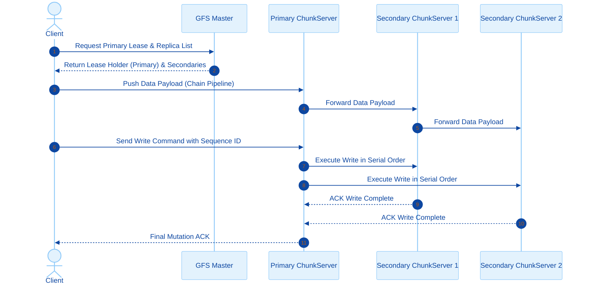
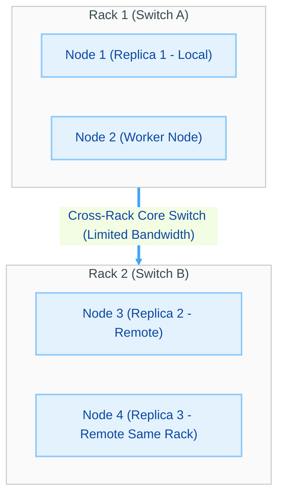
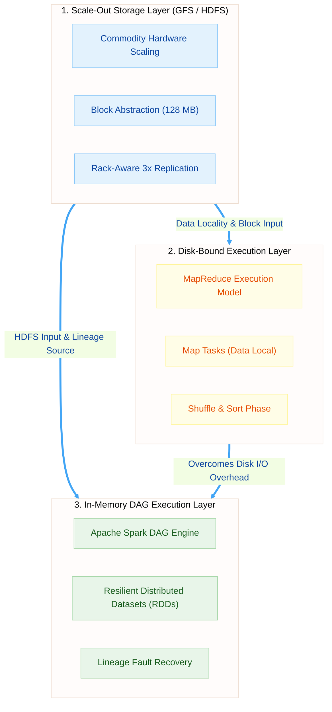

# Lecture 1.1: The Scale-Out Paradigm & Distributed Storage

> [!info] COURSE & EXAM INFORMATION
> **Course:** [[00_Big_Data_Infrastructure_Index-v3|Big Data Computing]] (M.Sc. Computer Science - Sapienza University of Rome, A.Y. 2026/2027)
> **Instructor:** Prof. Gabriele Tolomei (tolomei@di.uniroma1.it | Office 106, Building E, Viale Regina Elena 295)
> **Instructor Profile:** Associate Professor; Director of the [[#Course Overview|HERCOLE Lab]] (*Human-Explainable, Robust, and COllaborative LEarning*); Co-founder & CSO of tellmewAI (AI Act compliance platform). Ph.D. Ca' Foscari Venice, M.Sc. & B.Sc. University of Pisa, ex Yahoo Labs London.
> **Schedule & Rooms:** Wednesday 8:00–11:00 (Room 1L), Thursday 10:00–12:00 (Room 2L).
> **Assessment Method:** Oral seminar based on a recent, high-impact scientific paper approved by the instructor (from top-tier venues: SIGMOD, VLDB, OSDI, SOSP, NeurIPS, ICML, KDD).
> - *Individual:* ~12 min presentation + ~3 min Q&A (~15 min total).
> - *Pairs:* ~25 min presentation + ~5 min Q&A (~30 min total, equal division).
> - *30 Cum Laude:* Requires exceptional mastery, deep critical insight, and flawless academic communication.
> **Course Modules:**
> 1. [[Lecture_1_1_Scaling_Out-v3|Big Data Infrastructure]] (Distributed Storage, [[Lecture_1_2_MapReduce-v3|MapReduce]], [[Lecture_1_3_Spark-v3|In-Memory Spark DAGs]], Streaming)
> 2. High-Dimensional Data Representations (Dimensionality Reduction, Columnar Layouts, Embeddings)
> 3. Classical Non-Learning Tasks (Web Indexing, Sampling, Approximate Querying, Sub-linear Sketching, LSH)
> 4. Scale-Out Learning Systems (Large-Scale ERM, Parallel/Async SGD, Parameter Server, Federated Learning)

---

## Lesson Roadmap
This lecture lays the theoretical and physical foundation of distributed storage required by computation engines like [[Lecture_1_2_MapReduce-v3|MapReduce Execution Framework]] and [[Lecture_1_3_Spark-v3|Apache Spark Engine]]:
1. **[[#§ 1 — Why Scale Out?|Why Scale Out?]]** — Physical, architectural, and financial ceilings of single-node servers.
2. **[[#§ 2 — Fundamentals of Distributed Storage|Distributed Storage Principles]]** — Throughput vs latency, [[#Data Characteristics & Access Patterns|WORM pattern]], and [[#The Chunk / Block Abstraction|Block abstraction]].
3. **[[#§ 3 — The Google File System (GFS)|The Google File System (GFS)]]** — Decoupled metadata/data architecture and [[#Write Path Workflow & Lease Mechanism|lease mechanisms]].
4. **[[#§ 4 — Data Locality & Replication Strategies|Data Locality & Rack-Aware Replication]]** — Moving computation to data and [[#Failure Domains & Re-Replication|failure domains]].
5. **[[#§ 5 — Hadoop Distributed File System (HDFS)|Hadoop Distributed File System (HDFS)]]** — Open-source implementation and [[#Pipeline Write Process|pipeline streaming]].
6. **[[#§ 6 — Fault Management & Mathematical Modeling|Fault Management & Mathematical Modeling]]** — [[#Checksums & Silent Data Corruption|Checksums]] and [[#Mathematical Binomial Failure Model (Cluster of 10,000 Disks)|binomial probability modeling]].
7. **[[#§ 7 — Synthesis & Computational Layer Connection|Executive Synthesis]]** — Storage pillars driving [[Lecture_1_2_MapReduce-v3|MapReduce]] and [[Lecture_1_3_Spark-v3|Spark RDDs]].

---

## § 1 — Why Scale Out?

> [!quote] SCALE-OUT PHILOSOPHY
> *"At scale, everything fails. The art of distributed systems is making that survivable."* — Distributed Systems Axiom.
> A single infinitely fast, perfectly reliable machine **does not exist**. [[Lecture_1_1_Scaling_Out-v3|Big Data Infrastructure]] accepts physical hardware fallibility and shifts fault tolerance to software logic.

### The Challenge of Unprecedented Data Growth
Modern data growth vastly exceeds the physical storage and processing capacity of any single server:
- **Web-Scale Crawls:** Hundreds of billions of HTML pages resulting in multi-Petabyte corpora.
- **Logs & Telemetry:** Clickstreams, financial transactions, and IoT sensors accumulating Terabytes daily.
- **Scientific & Enterprise Datasets:** Genomics, astrophysics, and enterprise transaction logs reaching Exabyte scale.

While hard drive capacities double every few years, global data volume doubles every few months. Many production workloads generate data faster than a single physical disk controller can write to disk.

### Physical Limits of Single Server Scaling (Vertical Scaling / Scale Up)
Upgrading a single monolithic server ([[#Vertical Scaling (Scale-Up) vs Horizontal Scaling (Scale-Out)|Scale Up]]) hits insurmountable physical and economic barriers:
- **CPU:** Finite core density per socket and limited socket count per motherboard due to thermal envelopes.
- **RAM:** Physical DIMM slot limits and address bus constraints.
- **Storage:** Restricted drive bay capacity and bounded I/O controller bandwidth.
- **Networking:** Bottlenecked NIC bandwidth on a single chassis.

> [!warning] THE SUPERLINEAR COST CURVE
> High-end enterprise server hardware exhibits **superlinear cost growth**:
> - Commodity Server ($1\times$ specs): Baseline cost $1\times$.
> - High-End Server ($4\times$ specs): Relational cost $\sim 10\times+$.
> - Top-tier Mainframe ($16\times$ specs): Relational cost $\sim 100\times+$.
> Beyond a fixed threshold, doubling physical performance costs exponentially more, until no amount of money can purchase a single machine large enough.

### Horizontal Scaling (Scale Out) & Commodity Hardware Philosophy
[[#Vertical Scaling (Scale-Up) vs Horizontal Scaling (Scale-Out)|Horizontal Scaling (Scale Out)]] connects large clusters of low-cost **commodity hardware** servers:
- **Capacity:** Virtually unbounded by adding standard nodes to the cluster.
- **Cost:** Linear cost scaling ($N$ nodes cost $N \times C$).
- **Reliability:** Transferred from expensive physical hardware redundancy to **intelligent software abstraction**.

```mermaid
%%{init: {'theme': 'base', 'themeVariables': { 'transparent': true, 'background': 'transparent', 'primaryColor': '#E3F2FD', 'primaryTextColor': '#0D47A1', 'primaryBorderColor': '#90CAF9', 'lineColor': '#42A5F5', 'fontFamily': 'arial'}}}%%
graph TD
    subgraph ScaleUp ["Vertical Scaling (Scale-Up)"]
        S1["Single High-End Server<br/>(Monolithic & Expensive)"]
        S1 -->|"Add RAM / CPU"| S2["Hardware Wall<br/>(Thermal & Physical Limits)"]
        S2 -->|"Superlinear Cost"| S3["Economic Ceiling<br/>(16x Capacity = 100x Cost)"]
    end

    subgraph ScaleOut ["Horizontal Scaling (Scale-Out)"]
        C1["Commodity Node 1"]
        C2["Commodity Node 2"]
        C3["Commodity Node N"]
        C1 --- C2 --- C3
        C1 & C2 & C3 -->|"Linear Scale"| Cluster["Resilient Distributed Cluster<br/>(Unbounded Capacity & Linear Cost)"]
    end

    classDef scaleUpNode fill:#FFE0B2,stroke:#FFB74D,stroke-width:2px,color:#E65100
    classDef scaleOutNode fill:#E3F2FD,stroke:#90CAF9,stroke-width:2px,color:#0D47A1
    classDef clusterNode fill:#E8F5E9,stroke:#A5D6A7,stroke-width:2px,color:#1B5E20

    class S1,S2,S3 scaleUpNode
    class C1,C2,C3 scaleOutNode
    class Cluster clusterNode
```



> [!bug] HARDWARE FAILURE AS A ROUTINE EVENT
> Across a cluster of tens of thousands of nodes and disks, component failure ceases to be an anomaly and becomes a **daily statistical certainty**. At any given second, disks crash, memory corrupts, and network switches drop. [[Lecture_1_1_Scaling_Out-v3|Distributed File Systems]] treat failure as standard operational state.

### Checkpoint 1 — Scaling Foundations
> [!check] CONCEPTUAL CHECKPOINT
> 1. **What is the fundamental difference between Vertical Scaling and Horizontal Scaling?**
>    *Answer:* Vertical scaling ([[#Physical Limits of Single Server Scaling (Vertical Scaling / Scale Up)|Scale-Up]]) expands resources on a single node (RAM/CPU), hitting physical walls and superlinear costs. Horizontal scaling ([[#Horizontal Scaling (Scale Out) & Commodity Hardware Philosophy|Scale-Out]]) distributes data across commodity nodes, achieving unbounded capacity at linear cost.
> 2. **Why does Vertical Scaling encounter a strict economic wall?**
>    *Answer:* Monolithic high-spec motherboards, specialized multi-socket CPUs, and custom cooling incur exponential manufacturing and thermal overheads.
> 3. **Why do Big Data architectures mandate commodity hardware over mainframe servers?**
>    *Answer:* Aggregating thousands of economic commodity servers provides vastly higher aggregate compute/storage bandwidth at a fraction of the cost, delegating resilience to software like [[#The Google File System (GFS)|GFS]] and [[#Hadoop Distributed File System (HDFS)|HDFS]].
> 4. **Why must hardware failure be modeled as a continuous process?**
>    *Answer:* Probability dictates that across 10,000+ components, Mean Time Between Failures (MTBF) drops to hours, making simultaneous component failure constant.

---

## § 2 — Fundamentals of Distributed Storage

A **Distributed File System (DFS)** exposes a single, unified file system namespace while physically partitioning and storing data across thousands of distributed storage nodes.

> [!idea] DESIGN GOAL: AGGREGATE THROUGHPUT VS LATENCY
> Big Data DFS platforms maximize **Aggregate Cluster Throughput** (GB/s transferred globally across jobs) and tolerate higher single-I/O operation latency. Batch processing over petabyte datasets prioritizes massive parallel streaming bandwidth over sub-millisecond random access latency.

### Data Characteristics & Access Patterns
Big Data workloads deviate from traditional POSIX file system expectations:
1. **Gigantic File Sizes:** Individual files range from tens of Gigabytes to Terabytes (not Kilobytes).
2. **Sequential Read Workloads:** Files are streamed sequentially from start to end by analytical jobs like [[Lecture_1_2_MapReduce-v3|MapReduce Mappers]] and [[Lecture_1_3_Spark-v3|Spark RDD Partitions]]. Random small-byte seeks are explicitly discouraged.
3. **Write-Once, Read-Many (WORM):** Files are written once via sequential appends and read repeatedly. Arbitrary in-place file modifications are unsupported.

### The Chunk / Block Abstraction
A file is not stored as a single monolithic byte stream. Instead, the DFS splits it into large, fixed-size **Blocks / Chunks** (e.g., 64 MB or 128 MB). Each block is managed, replicated, and assigned independently across storage nodes.

> [!info] ADVANTAGES OF LARGE BLOCK SIZES
> - **Metadata Reduction:** Tracking fewer large blocks minimizes RAM consumption on the central metadata coordinator ([[#Master Node Architecture & Metadata Management|Master / NameNode]]).
> - **Computational Alignment:** A block serves as the atomic unit of parallel work, perfectly matching a [[Lecture_1_2_MapReduce-v3#Input Splits & Map Task Allocation|MapReduce Input Split]] or a [[Lecture_1_3_Spark-v3#RDD Partitions: The Unit of Parallelism|Spark RDD Partition]].
> - **Sequential I/O Optimization:** Large blocks amortize disk seek overhead, sustaining high-speed sequential disk reads.

### Decoupling Metadata Management from Data Storage
To eliminate performance bottlenecks, distributed file systems strictly separate control logic from bulk data transfers:
- **Control Path (Metadata):** Client requests block locations from the central [[#Master Node Architecture & Metadata Management|Master Node]].
- **Data Path (Bulk Streaming):** Client transfers data directly to and from [[#GFS Architecture & Node Mechanics|ChunkServers / DataNodes]] without routing through the Master.

### Network Topology Awareness
Distributed file systems model physical datacenter network structures:
- **In-Node I/O:** Fast local disk/bus speed (~GB/s).
- **In-Rack Switching:** High-bandwidth communication within the same rack (~10 Gbps).
- **Cross-Rack Core Switching:** Constrained inter-rack switch links shared across the entire cluster.

### Checkpoint 2 — DFS Principles
> [!check] CONCEPTUAL CHECKPOINT
> 1. **Why do Big Data DFS architectures optimize for Throughput rather than Latency?**
>    *Answer:* Analytical jobs process petabytes sequentially; aggregate bandwidth determines job completion time, making single-disk seek latency secondary.
> 2. **What are the three core assumptions of the WORM pattern?**
>    *Answer:* Files are written sequentially once, modification in-place is disallowed, and files are read repeatedly by parallel compute tasks.
> 3. **Why are Big Data block sizes (128 MB) vastly larger than OS block sizes (4 KB)?**
>    *Answer:* Large blocks drastically shrink metadata RAM overhead on the coordinator node and maximize sequential disk read throughput.
> 4. **What is the structural purpose of decoupling metadata management from data storage?**
>    *Answer:* It prevents the central Master node from becoming a bottleneck during multi-gigabit data transfers between clients and storage nodes.

---

## § 3 — The Google File System (GFS)

Introduced by Ghemawat et al. (Google, 2003), [[#The Google File System (GFS)|GFS]] established the blueprint for modern scale-out distributed storage systems.

### GFS Architecture & Node Mechanics
A GFS cluster consists of a single **Master Node** and hundreds of **ChunkServers** serving multiple **Clients**:
- **GFS Master:** Central coordinator maintaining namespace hierarchy, access control, file-to-chunk mappings, and current chunk locations.
- **GFS ChunkServers:** Worker storage nodes holding 64 MB chunk files on local Linux filesystems, identified by 64-bit immutable **Chunk Handles**.
- **GFS Clients:** Libraries embedded in application code implementing the GFS API (`open`, `read`, `write`, `snapshot`, `record append`).

```mermaid
%%{init: {'theme': 'base', 'themeVariables': { 'transparent': true, 'background': 'transparent', 'primaryColor': '#E3F2FD', 'primaryTextColor': '#0D47A1', 'primaryBorderColor': '#90CAF9', 'lineColor': '#42A5F5', 'fontFamily': 'arial'}}}%%
graph TD
    Client["Client Application"]
    Master["GFS Master Node<br/>(Metadata in RAM + OpLog)"]

    subgraph StorageCluster ["ChunkServer Cluster"]
        CS1["ChunkServer 1<br/>(Chunk 1, Replica A)"]
        CS2["ChunkServer 2<br/>(Chunk 1, Replica B)"]
        CS3["ChunkServer 3<br/>(Chunk 1, Replica C)"]
    end

    Client -->|"1. Request Metadata (File, Index)"| Master
    Master -->|"2. Chunk Handle & Replica Locations"| Client
    Client ==>|"3. Direct Data Stream (Bulk I/O)"| CS1
    CS1 -.->"4. Pipeline Data Replication"| CS2
    CS2 -.->"4. Pipeline Data Replication"| CS3

    classDef clientStyle fill:#E3F2FD,stroke:#90CAF9,stroke-width:2px,color:#0D47A1
    classDef masterStyle fill:#F3E5F5,stroke:#CE93D8,stroke-width:2px,color:#4A148C
    classDef chunkStyle fill:#E8F5E9,stroke:#A5D6A7,stroke-width:2px,color:#1B5E20

    class Client clientStyle
    class Master masterStyle
    class CS1,CS2,CS3 chunkStyle
```

### Master Node Architecture & Metadata Management
To ensure extreme metadata lookup speeds, the GFS Master stores all metadata in **RAM**:
1. **File and Chunk Namespaces:** Directory structures and file lookup tables.
2. **File-to-Chunk Mappings:** Ordered array of chunk handles constituting each file.
3. **Chunk Replica Locations:** Mapping from chunk handle to current ChunkServer IP addresses.

> [!info] METADATA PERSISTENCE & HEARTBEATS
> - **Operation Log (OpLog):** Sequential disk log of all namespace and mapping mutations. Replicated on remote backup machines.
> - **Checkpoints:** Compact B-tree snapshots of Master RAM state used for fast recovery.
> - **Dynamic Chunk Locations:** The Master does **not** persist chunk locations on disk. Upon startup, it queries all ChunkServers via **Heartbeat Messages** to dynamically reconstruct chunk location tables.

### Read Path Workflow
1. **Translation:** Client converts `(Filename, Byte Offset)` into `(Filename, Chunk Index)` using the fixed 64 MB chunk size:
   $$\text{Chunk Index} = \lfloor \text{Byte Offset} / 64\text{MB} \rfloor$$
2. **Metadata Lookup:** Client sends `(Filename, Chunk Index)` to the GFS Master.
3. **Response:** Master returns the 64-bit Chunk Handle and IP addresses of all ChunkServers holding active replicas.
4. **Caching:** Client caches metadata locally (keyed by `Filename + Chunk Index`).
5. **Direct Read:** Client requests data directly from the nearest ChunkServer using Chunk Handle and byte range.

### Write Path Workflow & Lease Mechanism
GFS uses **Primary Leases** to guarantee a deterministic write order across mutated replicas:
1. **Lease Grant:** Master grants a 60-second lease to one ChunkServer, designating it as **Primary**.
2. **Decoupled Pipelining:** Client pushes raw data payload linearly through a chain of ChunkServers (Primary and Secondaries) to utilize full network bandwidth.
3. **Write Order Command:** Once all ChunkServers confirm data receipt in memory buffers, Client issues an explicit Write Command to the Primary.
4. **Serial Execution:** Primary assigns consecutive sequence numbers to all pending writes and applies them locally in order.
5. **Secondary Forwarding:** Primary forwards the serialized order to Secondaries, which execute mutations in identical sequence.
6. **Acknowledgement:** Secondaries reply to Primary, which returns success to the Client.



### Lazy Garbage Collection
When a file is deleted in GFS:
1. Master logs deletion immediately and renames file to a hidden tombstone name with timestamp.
2. File remains readable under tombstone name for a grace period (e.g., 3 days).
3. During background garbage collection, Master erases tombstone files from RAM metadata.
4. ChunkServers report orphan chunks in Heartbeats; Master instructs ChunkServers to delete underlying physical files.

### Checkpoint 3 — GFS Mechanics
> [!check] CONCEPTUAL CHECKPOINT
> 1. **Why does the GFS Master keep chunk locations in RAM without persisting them to disk?**
>    *Answer:* ChunkServers frequently join, crash, or rename disks. Dynamically polling ChunkServers via Heartbeats avoids complex, error-prone disk sync state on the Master.
> 2. **What is the purpose of the GFS Operation Log (OpLog)?**
>    *Answer:* It records sequential metadata mutations on disk to restore Master RAM state accurately after a power failure or crash.
> 3. **How does the Primary Lease mechanism prevent data inconsistency across replicas?**
>    *Answer:* The Primary ChunkServer dictates a single, serialized sequence order for all mutations, ensuring every replica executes writes identically.
> 4. **How does GFS pipeline data transfers to optimize network utilization?**
>    *Answer:* Data is pushed along a linear chain of ChunkServers based on network proximity, decoupling data transport from control flow.

---

## § 4 — Data Locality & Replication Strategies

The cardinal principle of scale-out architecture is **Data Locality**: *Move computation to data, not data to computation*.

### Bandwidth Hierarchy & Transfer Costs
Network links inside a datacenter form a bandwidth pyramid:

| Access Path | Typical Throughput | Latency Penalty | Relative Cost |
| :--- | :--- | :--- | :--- |
| **In-Node Bus (RAM / NVMe)** | 10–50 GB/s | $< 1 \mu s$ | Baseline ($1\times$) |
| **Same Rack (Top-of-Rack Switch)** | 1–10 GB/s | $\sim 100 \mu s$ | Low ($2\times$) |
| **Cross-Rack Core Switch** | 100 MB/s – 1 GB/s | $\sim 1–10 ms$ | **Bottleneck ($20\times$)** |

Moving a 100 TB dataset across core switches saturates datacenter links and creates severe network congestion. Shipping a 1 KB compiled program binary to nodes holding local data blocks eliminates cross-rack traffic.

### Rack-Aware Placement Strategy (3x Replication Factor)
To balance fault survival against write network overhead, systems like GFS and HDFS deploy a **Rack-Aware 3x Placement Policy**:
- **Replica 1:** Placed on the local node submitting the write (or a randomly chosen node in the same rack).
- **Replica 2:** Placed on a node in a **different, remote rack** (protects against complete Top-of-Rack switch failure).
- **Replica 3:** Placed on a **different node in the same remote rack** (provides intra-rack bandwidth choices while avoiding extra cross-rack writes).



### Failure Domains & Re-Replication
If a storage node crashes:
1. Master stops receiving Heartbeats from the node.
2. Master flags all blocks hosted on that node as **under-replicated**.
3. Master prioritizes blocks with the lowest replica count (e.g., blocks reduced to 1 replica are prioritized over blocks at 2 replicas).
4. Master schedules background re-replication across healthy ChunkServers without disrupting active query workloads.

```mermaid
%%{init: {'theme': 'base', 'themeVariables': { 'transparent': true, 'background': 'transparent', 'primaryColor': '#E3F2FD', 'primaryTextColor': '#0D47A1', 'primaryBorderColor': '#90CAF9', 'lineColor': '#42A5F5', 'fontFamily': 'arial'}}}%%
graph LR
    DiskFail["Node / Disk Failure<br/>(Heartbeat Lost)"] --> Detect["Master Detects Timeout<br/>(10-minute threshold)"]
    Detect --> Scan["Scan Metadata for<br/>Under-Replicated Blocks"]
    Scan --> Schedule["Schedule Parallel Copy Tasks<br/>to Healthy Nodes"]
    Schedule --> Restored["Target 3x Replication Restored<br/>(Zero Data Loss)"]

    classDef failStyle fill:#FFEBEE,stroke:#EF9A9A,stroke-width:2px,color:#C62828
    classDef processStyle fill:#E3F2FD,stroke:#90CAF9,stroke-width:2px,color:#0D47A1
    classDef successStyle fill:#E8F5E9,stroke:#A5D6A7,stroke-width:2px,color:#1B5E20

    class DiskFail failStyle
    class Detect,Scan,Schedule processStyle
    class Restored successStyle
```



### Checkpoint 4 — Locality & Placement
> [!check] CONCEPTUAL CHECKPOINT
> 1. **Explain the principle "Move computation to data, not data to computation".**
>    *Answer:* Code binaries are lightweight (Kilobytes) while datasets are massive (Terabytes). Executing code on the node physically storing the data block avoids network saturation.
> 2. **Why is Replica 2 placed on a different rack than Replica 1?**
>    *Answer:* To survive complete rack failures caused by Top-of-Rack switch outages or power distributor failure.
> 3. **Why is Replica 3 placed on the same remote rack as Replica 2?**
>    *Answer:* It avoids crossing core switches a third time while providing a secondary local source for reads within that remote rack.
> 4. **How does re-replication prevent catastrophic data loss during disk crashes?**
>    *Answer:* Master detects missing heartbeats and proactively clones remaining healthy replicas to new nodes before subsequent disk failures occur.

---

## § 5 — Hadoop Distributed File System (HDFS)

[[#Hadoop Distributed File System (HDFS)|HDFS]] is the Apache open-source implementation of the GFS architecture, powering the storage layer for [[Lecture_1_2_MapReduce-v3|Apache Hadoop]] and [[Lecture_1_3_Spark-v3|Apache Spark]].

### Architectural Terminology Mapping: GFS vs HDFS

| Functional Role | GFS Terminology | HDFS Terminology |
| :--- | :--- | :--- |
| **Central Metadata Coordinator** | GFS Master | **NameNode** |
| **Worker Storage Node** | GFS ChunkServer | **DataNode** |
| **Atomic Storage Unit** | Chunk (64 MB) | **Block (128 MB default)** |
| **Client API Library** | GFS Client | **DFSClient** |
| **Metadata Audit Log** | Operation Log (OpLog) | **EditLog** |
| **RAM Snapshot File** | Checkpoint | **FSImage** |
| **Secondary Metadata Helper** | Backup Master | **Secondary NameNode** |

### HDFS Component Breakdown
- **NameNode:** Manages directory namespace, block locations, and file permissions. Stores entire namespace tree in RAM for instant lookup.
- **Secondary NameNode:** Does **not** serve as a high-availability backup NameNode! Instead, it performs background merging of the `EditLog` into the `FSImage` file to prevent the `EditLog` from growing excessively large.
- **DataNodes:** Store raw block files on local underlying disk filesystems and respond to read/write requests from clients.

### Pipeline Write Process in HDFS
1. Client calls `DFSClient.create()` to request a new file from NameNode.
2. NameNode verifies permissions and returns target DataNode pipeline (e.g., DataNode A, DataNode B, DataNode C).
3. Client splits data into small 64 KB **Packets** and streams them to DataNode A.
4. DataNode A writes packet to local disk buffer and immediately pushes it to DataNode B.
5. DataNode B pushes packet to DataNode C. Packets flow downstream through the pipeline simultaneously.
6. Acknowledgements flow backwards up the pipeline (C -> B -> A -> Client).

### Checkpoint 5 — HDFS Architecture
> [!check] CONCEPTUAL CHECKPOINT
> 1. **What is the common misconception regarding the Secondary NameNode?**
>    *Answer:* Developers assume it is a hot standby failover server. In reality, it is a helper node that periodically merges `EditLog` into `FSImage` to speed up NameNode restarts.
> 2. **What is the difference between `FSImage` and `EditLog` in HDFS?**
>    *Answer:* `FSImage` is a complete snapshot of NameNode RAM state at a point in time; `EditLog` records sequential metadata modifications made since the last snapshot.
> 3. **How large is the default block size in modern HDFS installations?**
>    *Answer:* 128 MB (or 256 MB in large enterprise clusters).
> 4. **How do 64 KB packets stream during HDFS writes?**
>    *Answer:* Packets are pipelined across DataNodes concurrently, ensuring high network throughput without waiting for full block assembly.

---

## § 6 — Fault Management & Mathematical Modeling

Fault management in distributed systems requires both active data integrity checking and formal probabilistic risk modeling.

### Checksums & Silent Data Corruption
Disk media degradations, cosmic ray bit flips, and network switch noise cause **Silent Data Corruption**:
- Each 512-byte block slice is assigned a 32-bit **CRC32 Checksum** upon creation.
- Checksums are stored separately in block metadata files.
- During every read operation, DataNodes recompute checksums over physical bytes and compare against saved metadata.
- If checksum mismatch occurs, Client reports corruption to NameNode, fetches data from an uncorrupted replica, and NameNode schedules repair of the corrupted block.

### Mathematical Binomial Failure Model (Cluster of 10,000 Disks)

Consider a large production cluster with the following parameters:
- Total Independent Disks: $N = 10,000$
- Probability of single disk failure in a given 1-year window: $p = 0.01$ ($1\%$)
- Mean Time To Repair (MTTR) a failed disk: $t_{\text{repair}} = 1\text{ day} = 1/365\text{ year}$.

#### Expected Daily Disk Failures
The expected number of disk failures per year is given by the expectation of a Binomial Distribution $\mathbb{E}[X] = N \cdot p$:
$$\mathbb{E}[\text{Failures/Year}] = 10,000 \times 0.01 = 100\text{ disk failures per year}$$
$$\mathbb{E}[\text{Failures/Day}] = \frac{100}{365} \approx 0.274\text{ failures/day} \implies 1\text{ disk failure every } 3.65\text{ days}$$

#### Probability of $k$ Simultaneous Disk Failures
Using the Binomial Distribution Probability Mass Function $P(X = k) = \binom{N}{k} p^k (1-p)^{N-k}$:

$$\binom{N}{k} = \frac{N!}{k!(N-k)!}$$

- **Probability of exactly 0 failures on any given day:**
  $$P(X = 0) = \binom{10000}{0} (0.01)^0 (0.99)^{10000} \approx e^{-100} \approx 3.72 \times 10^{-44} \approx 0$$
- **Probability of at least 1 failure on a given day:**
  $$P(X \ge 1) = 1 - P(X = 0) \approx 1.0\text{ (100\% certainty!)}$$

#### Probability of Unrecoverable Data Loss (Triple Disk Failure on Same Block)
For a specific chunk replicated 3 times ($R = 3$), unrecoverable data loss occurs **only if all 3 nodes hosting replicas fail simultaneously within the repair window $t_{\text{repair}}$**.

Let $p_{\text{window}} = p \times \frac{1}{365} = \frac{0.01}{365} \approx 2.74 \times 10^{-5}$ be the probability of a disk failing during a 1-day repair window.
The probability that all 3 specific replica disks crash within the same 1-day window is:
$$P(\text{Data Loss per Chunk}) = (p_{\text{window}})^3 = (2.74 \times 10^{-5})^3 \approx 2.06 \times 10^{-14}$$

> [!idea] MEANING OF TRIPLE FAILURE PROBABILITY
> With $P(\text{Loss}) \sim 10^{-14}$, 3x rack-aware replication guarantees **99.999999999% (11 Nines) Data Durability**, converting continuous daily hardware crashes into zero statistical data loss!

### Failure Scenario: ChunkServer Death During Read
1. Client sends read request to ChunkServer A.
2. ChunkServer A fails to respond or drops connection (socket timeout).
3. Client immediately falls back to ChunkServer B using cached metadata.
4. Client notifies NameNode of ChunkServer A unresponsive state.
5. Client resumes reading seamlessly without throwing application errors.

### Checkpoint 6 — Fault Modeling
> [!check] CONCEPTUAL CHECKPOINT
> 1. **How do CRC32 checksums detect silent bit rot on hard drives?**
>    *Answer:* Bytes read from disk are hashed into a CRC32 value and matched against original write checksums; discrepancies trigger automated repair.
> 2. **What is the expected annual failure rate for a cluster with 10,000 disks at 1% failure probability?**
>    *Answer:* 100 disk failures per year (~1 failure every 3.65 days).
> 3. **Why does 3x replication achieve 11 Nines of data durability despite constant hardware crashes?**
>    *Answer:* Because the joint probability of 3 specific disks failing within the narrow 1-day repair window is infinitesimally small ($\sim 10^{-14}$).
> 4. **What happens at the application level when a DataNode dies mid-stream?**
>    *Answer:* The client library transparently fails over to the next available replica node listed in cached metadata.

---

## § 7 — Synthesis & Computational Layer Connection

Scale-out storage is the indispensable foundation for big data execution models:
- [[Lecture_1_2_MapReduce-v3|MapReduce]] relies on HDFS block locality to schedule Map tasks without network traffic.
- [[Lecture_1_3_Spark-v3|Apache Spark]] builds RDD partitions directly on top of underlying HDFS block boundaries.



---

> [!summary] KEY TAKEAWAYS & EXECUTIVE SYNTHESIS
> - **Scale-Out Economics:** Scaling horizontally via commodity hardware delivers linear cost growth and unbounded storage capacity, shifting fault tolerance to software logic.
> - **Block Abstraction:** Splitting files into large 128 MB blocks shrinks metadata RAM footprints on the Master/NameNode and maximizes sequential disk read throughput.
> - **Decoupled Architecture:** Separating metadata control paths (Master) from bulk streaming data paths (ChunkServers/DataNodes) prevents central processing bottlenecks.
> - **Data Locality Principle:** Shipping lightweight application code to the node physically hosting target blocks eliminates datacenter core switch bottlenecks.
> - **Rack-Aware 3x Replication:** Placing Replica 1 locally, Replica 2 on a remote rack, and Replica 3 on the same remote rack yields 11 Nines of data durability ($P \sim 10^{-14}$) while protecting against rack switch outages.
> - **Mathematical Failure Certainty:** On a 10,000-disk cluster, $P(\ge 1\text{ failure/day}) \approx 100\%$. Continuous automated re-replication keeps data loss near zero.
