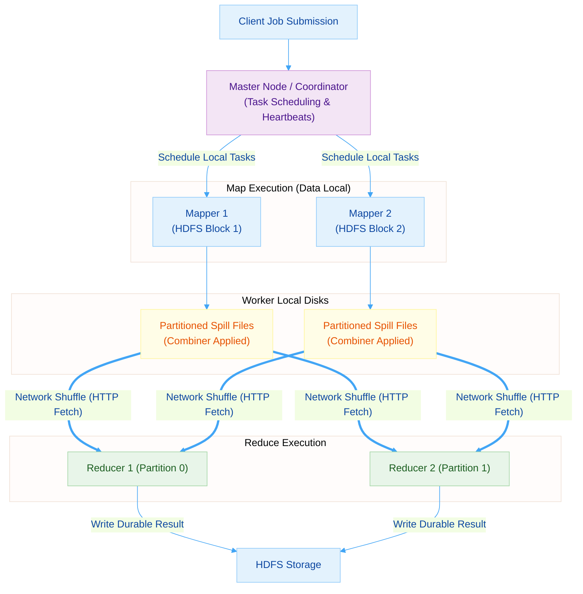
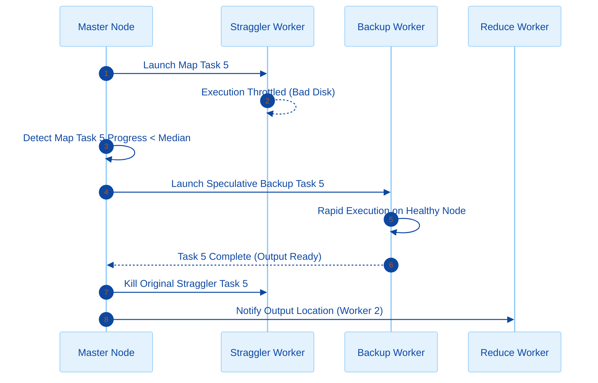

# Lecture 1.2: The MapReduce Execution Model

> [!info] COURSE & EXAM INFORMATION
> **Course:** [[00_Big_Data_Infrastructure_Index-v3|Big Data Computing]] (M.Sc. Computer Science - Sapienza University of Rome, A.Y. 2026/2027)
> **Instructor:** Prof. Gabriele Tolomei (tolomei@di.uniroma1.it)
> **Module Context:** This lecture introduces the classic batch computational layer built directly on top of distributed storage like [[Lecture_1_1_Scaling_Out-v3#The Google File System (GFS)|Google File System (GFS)]] and [[Lecture_1_1_Scaling_Out-v3#Hadoop Distributed File System (HDFS)|Hadoop Distributed File System (HDFS)]], serving as the stepping stone toward modern in-memory engines like [[Lecture_1_3_Spark-v3|Apache Spark]].

---

## Lesson Roadmap
1. **[[#§ 1 — The MapReduce Abstraction|The MapReduce Abstraction]]** — Functional origins, [[#User-Defined Functions (UDFs)|Map and Reduce primitives]], and [[#Worked Application Example 1: Word Count|Word Count / Inverted Index]].
2. **[[#§ 2 — Execution Architecture|Execution Architecture]]** — [[#Input Splits & Map Task Allocation|Data-local task scheduling]], [[#Over-Decomposition of Tasks|over-decomposition]], and [[#Combiners: Local Pre-Aggregation|Combiners]].
3. **[[#§ 3 — Shuffle, Sort, and the Reduce Phase|Shuffle, Sort, & Reduce]]** — [[#Mechanics of the Shuffle & Sort Phase|Circular memory buffers]], [[#End-to-End Execution Trace|all-to-all network fetches]], and external merge-sorting.
4. **[[#§ 4 — Fault Tolerance & Straggler Management|Fault Tolerance & Stragglers]]** — Heartbeat monitoring, task re-execution, and [[#Speculative Execution (Straggler Mitigation)|Speculative Execution]].
5. **[[#§ 5 — MapReduce Limitations & Transition to Spark|Limitations & Transition]]** — Structural disk I/O bottlenecks motivating [[Lecture_1_3_Spark-v3|Apache Spark DAG Engine]].

---

## § 1 — The MapReduce Abstraction

> [!quote] FUNCTIONAL DISTRIBUTED COMPUTING
> *"Give me a map function and a reduce function, and I will parallelize them across ten thousand machines while handling every hardware crash behind your back."* — MapReduce Paradigm Core Promise.

Developed by Dean and Ghemawat (Google, 2004), [[Lecture_1_2_MapReduce-v3|MapReduce]] abstracts away network socket management, data partitioning, lock synchronization, and machine crashes, allowing developers to write simple sequential data transformation functions.

### Functional Origins
MapReduce draws inspiration from functional programming primitives (`map` and `reduce` / `fold`):
- **Map:** Applies a function transformation to each element of a collection independently, producing a new collection of identical cardinality:
  $$\text{map}: (A \to B) \implies \text{List}[A] \to \text{List}[B]$$
- **Reduce:** Aggregates a collection of elements down to a cumulative summary value using an associative and commutative operator:
  $$\text{reduce}: (B \times B \to B) \implies \text{List}[B] \to B$$

### User-Defined Functions (UDFs)
From the user's perspective, data processing is expressed strictly as two functional transformations over key-value pairs:

#### Semantics of the Map Primitive
The Map function accepts an input key-value pair and emits zero or more intermediate key-value pairs:
$$\text{Map}(k_1, v_1) \implies \text{List}(k_2, v_2)$$
- $k_1, v_1$: Input record key and value (e.g., file byte offset and line raw text string).
- $k_2, v_2$: Intermediate key and value (e.g., extracted word string and count integer $1$).

#### Semantics of the Reduce Primitive
The Reduce function receives an intermediate key $k_2$ combined with an iterator over all intermediate values associated with $k_2$, emitting final output key-value pairs:
$$\text{Reduce}(k_2, \text{List}(v_2)) \implies \text{List}(k_3, v_3)$$

```mermaid
%%{init: {'theme': 'base', 'themeVariables': { 'transparent': true, 'background': 'transparent', 'primaryColor': '#E3F2FD', 'primaryTextColor': '#0D47A1', 'primaryBorderColor': '#90CAF9', 'lineColor': '#42A5F5', 'fontFamily': 'arial'}}}%%
graph LR
    subgraph InputPhase ["1. HDFS Input Split"]
        In["(k1, v1) Record"]
    end

    subgraph MapPhase ["2. Map Transformation"]
        MapFunc["User Map UDF<br/>Emits (k2, v2) Pairs"]
    end

    subgraph ShufflePhase ["3. Shuffle & Sort"]
        Sort["Grouping by Key<br/>(k2, [v2_a, v2_b, ...])"]
    end

    subgraph ReducePhase ["4. Reduce Transformation"]
        RedFunc["User Reduce UDF<br/>Aggregates Values per Key"]
    end

    subgraph OutputPhase ["5. Final HDFS Output"]
        Out["(k3, v3) Result"]
    end

    In --> MapFunc
    MapFunc --> Sort
    Sort --> RedFunc
    RedFunc --> Out

    classDef inStyle fill:#E3F2FD,stroke:#90CAF9,color:#0D47A1
    classDef mapStyle fill:#FFFDE7,stroke:#FFF59D,color:#E65100
    classDef shuffleStyle fill:#F3E5F5,stroke:#CE93D8,color:#4A148C
    classDef reduceStyle fill:#E8F5E9,stroke:#A5D6A7,color:#1B5E20
    classDef outStyle fill:#E0F2F1,stroke:#80CBC4,color:#004D40

    class In inStyle
    class MapFunc mapStyle
    class Sort shuffleStyle
    class RedFunc reduceStyle
    class Out outStyle
```



### Worked Application Example 1: Word Count

```python
# Map Function: Executed in parallel across every 128 MB text block
def map(document_id, text_line):
    for word in text_line.split():
        emit_intermediate(word.lower(), 1)

# Reduce Function: Executed for each unique word emitted across the dataset
def reduce(word, counts_list):
    total_occurrences = sum(counts_list)
    emit_final(word, total_occurrences)
```

### Worked Application Example 2: Inverted Index
To build a web search engine index mapping terms to document IDs:

```python
def map(document_id, document_text):
    for word in set(document_text.split()):
        emit_intermediate(word, document_id)

def reduce(word, document_ids_list):
    emit_final(word, sorted(list(set(document_ids_list))))
```

### Pure Functions & Determinism Constraint
MapReduce requires Map and Reduce functions to be **pure functions**:
- Must depend solely on their input arguments.
- Must produce zero side effects (no global state modification, no external network calls, no disk writes outside standard output emitters).
- **Determinism Requirement:** Re-executing a Map or Reduce task on identical inputs must yield identical output pairs. This guarantees fault recovery via transparent task re-execution.

### Checkpoint 1 — Abstraction Foundations
> [!check] CONCEPTUAL CHECKPOINT
> 1. **What are the input and output type signatures of the Map function?**
>    *Answer:* $\text{Map}(k_1, v_1) \implies \text{List}(k_2, v_2)$.
> 2. **What are the input and output type signatures of the Reduce function?**
>    *Answer:* $\text{Reduce}(k_2, \text{List}(v_2)) \implies \text{List}(k_3, v_3)$.
> 3. **Why must MapReduce UDFs be strictly deterministic and pure?**
>    *Answer:* Determinism allows the Master to re-execute crashed tasks on new nodes without creating state corruption or inconsistent dataset outputs.
> 4. **How does the Inverted Index example demonstrate data aggregation across documents?**
>    *Answer:* Map emits `(word, doc_id)`, Shuffle groups all `doc_ids` per word into `(word, [doc1, doc2, ...])`, and Reduce formats the final document posting list.

---

## § 2 — Execution Architecture

The MapReduce framework schedules and coordinates execution across a master-worker cluster.

### Input Splits & Map Task Allocation
1. Framework splits input dataset stored on [[Lecture_1_1_Scaling_Out-v3#Hadoop Distributed File System (HDFS)|HDFS]] into $M$ **Input Splits** corresponding to 128 MB physical blocks.
2. Master assigns Map tasks to Worker nodes leveraging [[Lecture_1_1_Scaling_Out-v3#Data Locality & Replication Strategies|Data Locality]]:
   - **Process Local:** Task assigned to worker running on the exact physical node holding the HDFS block.
   - **Rack Local:** Task assigned to a worker on the same network rack holding the HDFS block.
   - **Off Switch:** Task assigned to an arbitrary worker across core switches (fallback).

### Over-Decomposition of Tasks
To achieve dynamic load balancing, MapReduce over-decomposes jobs into far more tasks than physical machines:
$$M \gg N \quad \text{and} \quad R \gg N$$
Where $M$ is the number of Map tasks, $R$ is the number of Reduce tasks, and $N$ is the number of physical worker nodes in the cluster.
- **Dynamic Load Balancing:** Fast workers finish assigned tasks quickly and pull remaining pending tasks from the Master queue.
- **Fast Recovery:** If a worker holding 10 completed Map tasks dies, those 10 tasks are re-assigned and executed concurrently across 10 different healthy nodes.

### Intermediate Key Partitioning
Intermediate key-value pairs emitted by Mappers are assigned to one of $R$ Reduce tasks using a hash partitioning function:
$$\text{Reduce Task ID} = \text{hash}(k_2) \pmod R$$
Default partitioner uses `hash(key) % R`, guaranteeing that all pairs sharing the exact same key $k_2$ land on the exact same Reducer node.

### Combiners: Local Pre-Aggregation
To minimize cross-rack network congestion during the [[#Mechanics of the Shuffle & Sort Phase|Shuffle Phase]], MapReduce supports an optional **Combiner Function**:
- Acts as a local, in-memory "Mini-Reducer" on the Mapper node.
- Pre-aggregates intermediate outputs before writing to local disk.
- *Mathematical Constraint:* The aggregation operator must be **associative and commutative**:
  $$(a + b) + c = a + (b + c) \quad \text{and} \quad a + b = b + a$$
  *Example:* `SUM`, `MAX`, `MIN` work as Combiners. `AVERAGE` does **not** work directly because $\text{AVG}(\text{AVG}(A), \text{AVG}(B)) \ne \text{AVG}(A \cup B)$.



### Checkpoint 2 — Execution Architecture
> [!check] CONCEPTUAL CHECKPOINT
> 1. **How does Data Locality dictate Map task scheduling?**
>    *Answer:* Master schedules Map tasks on nodes physically storing target 128 MB HDFS blocks, avoiding cross-rack network reads.
> 2. **What is the mathematical definition of task Over-Decomposition?**
>    *Answer:* Setting task counts $M$ and $R$ vastly larger than physical cluster nodes $N$ ($M, R \gg N$).
> 3. **Why does intermediate key partitioning use `hash(key) % R`?**
>    *Answer:* To ensure all records sharing intermediate key $k_2$ route to the exact same Reducer $R_i$.
> 4. **Why can `SUM` be used as a Combiner, while `AVERAGE` cannot?**
>    *Answer:* Addition is associative and commutative; average is not associative. To compute average, mappers must emit `(sum, count)` pairs.

---

## § 3 — Shuffle, Sort, and the Reduce Phase

The **Shuffle and Sort Phase** is the critical core bridge transferring intermediate data from Mappers to Reducers.

### Mechanics of the Shuffle & Sort Phase
1. **Circular Memory Buffer:** Each Map task writes intermediate key-value pairs to a 100 MB circular RAM buffer.
2. **Buffer Spilling:** When RAM buffer reaches capacity threshold ($80\%$ or 80 MB), a background thread spills contents to local disk.
3. **In-Memory Quicksort:** Prior to spilling, data in buffer is partitioned by `hash(key) % R` and sorted by key $k_2$ in memory.
4. **Local Merge-Sort:** As Map task completes, multiple spill files are merged into a single partitioned, sorted local disk file.
5. **All-to-All Network Fetch (Shuffle):** Reducers pull their assigned partition files from all completed Mappers via concurrent HTTP requests.
6. **External Merge-Sort on Reducer:** Reducer merges fetched partitions from all $M$ Mappers using an external multi-pass merge-sort, feeding a continuous stream of `(k2, List(v2))` to the user's Reduce function.

```mermaid
%%{init: {'theme': 'base', 'themeVariables': { 'transparent': true, 'background': 'transparent', 'primaryColor': '#E3F2FD', 'primaryTextColor': '#0D47A1', 'primaryBorderColor': '#90CAF9', 'lineColor': '#42A5F5', 'fontFamily': 'arial'}}}%%
graph LR
    subgraph MapSide ["Mapper Node"]
        MB["100 MB Circular RAM Buffer"] -->|"80% Threshold Spilling"| QuickSort["In-Memory Quicksort<br/>by Key Partition"]
        QuickSort --> LocalDisk["Merge Spill Files<br/>into Local Sorted Disk File"]
    end

    subgraph NetworkShuffle ["Network Transfer"]
        LocalDisk ==>|"All-to-All HTTP Shuffle"| Fetch["Reducer Fetch Buffer"]
    end

    subgraph ReduceSide ["Reducer Node"]
        Fetch --> ExtSort["External Merge-Sort<br/>Combine Partitions"]
        ExtSort --> Stream["Sorted Stream<br/>(k2, List(v2)) -> Reduce UDF"]
    end

    classDef mapStyle fill:#E3F2FD,stroke:#90CAF9,color:#0D47A1
    classDef netStyle fill:#FFE0B2,stroke:#FFB74D,color:#E65100
    classDef redStyle fill:#E8F5E9,stroke:#A5D6A7,color:#1B5E20

    class MB,QuickSort,LocalDisk mapStyle
    class Fetch netStyle
    class ExtSort,Stream redStyle
```



### End-to-End Execution Trace

```
INPUT TEXT BLOCK: "apple banana apple"
1. MAPPER OUTPUT (RAM Buffer):
   ("apple", 1), ("banana", 1), ("apple", 1)

2. COMBINER (Local Memory Aggregation):
   ("apple", 2), ("banana", 1)

3. LOCAL DISK SPILL (Sorted by Key):
   Partition 0 -> ("apple", 2)
   Partition 1 -> ("banana", 1)

4. NETWORK SHUFFLE (HTTP Fetch by Reducer 0):
   Reducer 0 fetches Partition 0 from all Mappers

5. REDUCER MERGE-SORT & REDUCE UDF:
   Reducer 0 receives ("apple", [2, 5, 1, 3]) -> emits ("apple", 11)
```

### Checkpoint 3 — Shuffle & Sort
> [!check] CONCEPTUAL CHECKPOINT
> 1. **At what memory threshold does the Mapper circular buffer spill to disk?**
>    *Answer:* Typically at 80% capacity (80 MB out of a 100 MB buffer) to allow uninterrupted map writes while spilling occurs.
> 2. **Where are intermediate Map output files physically stored?**
>    *Answer:* On the **local disk** of the Mapper worker node (not on HDFS!).
> 3. **What is the difference between In-Memory Quicksort and External Merge-Sort in MapReduce?**
>    *Answer:* Quicksort sorts records inside the 80 MB memory buffer before disk spill; External Merge-Sort merges large spill files and incoming network partitions on the Reducer.
> 4. **Why is the Shuffle Phase considered the primary network bottleneck of MapReduce?**
>    *Answer:* Because $M$ mappers transfer intermediate partition files across datacenter switches to $R$ reducers in an all-to-all network traffic pattern.

---

## § 4 — Fault Tolerance & Straggler Management

MapReduce guarantees robust execution across unreliable clusters through continuous health monitoring and speculative re-execution.

### Worker Failure Management
- **Heartbeat Monitoring:** Master periodically pings every worker node.
- **Worker Crash Detection:** If a worker fails to respond within timeout window (e.g., 10 minutes), Master marks worker as FAILED.
- **Re-executing Map Tasks:** Completed Map tasks on failed worker **must be re-executed** because intermediate outputs reside on worker's local disk, which is now unreachable!
- **Re-executing Reduce Tasks:** Completed Reduce tasks do **not** need re-execution because their outputs are safely stored as replicated files on [[Lecture_1_1_Scaling_Out-v3#Hadoop Distributed File System (HDFS)|HDFS]].

### The Straggler Problem (Slow Nodes)
A **Straggler** is a worker node that executes a task unusually slowly due to failing hard drives, bad RAM, CPU throttling, or misconfigured network switches.
- In MapReduce, a job cannot finish until its very last task completes.
- A single straggler running at $1\%$ speed delays the entire multi-thousand node cluster job.

### Speculative Execution (Straggler Mitigation)
To eliminate straggler delays, MapReduce implements **Speculative Execution**:
1. When a job approaches completion, Master monitors task progress rates.
2. Master identifies tasks running significantly slower than cluster median.
3. Master launches an identical **Backup (Speculative) Task** on a different healthy node.
4. Whichever task instance completes first (original or backup) emits its output and notifies Master.
5. Master terminates the remaining redundant task instance.



### Checkpoint 4 — Fault Tolerance
> [!check] CONCEPTUAL CHECKPOINT
> 1. **Why must completed Map tasks be re-executed if a worker crashes, while completed Reduce tasks do not?**
>    *Answer:* Map outputs reside on the crashed worker's unreachable local disk; Reduce outputs are stored redundantly on HDFS.
> 2. **What physical conditions cause a worker node to become a Straggler?**
>    *Answer:* Degraded hard drive sectors, thermal CPU throttling, memory leaks, or switch port packet drops.
> 3. **How does Speculative Execution neutralize straggler tasks?**
>    *Answer:* Master launches duplicate task instances on healthy nodes and accepts whichever instance finishes first.
> 4. **Does Speculative Execution alter the deterministic result of a MapReduce job?**
>    *Answer:* No, because MapReduce UDFs are pure functions, so original and speculative tasks produce identical key-value outputs.

---

## § 5 — MapReduce Limitations & Transition to Spark

While MapReduce revolutionized large-scale batch processing, real-world analytical workloads exposed severe structural limitations.

### Storage Layer vs Compute Layer Comparison

| Architectural Aspect | Storage Layer ([[Lecture_1_1_Scaling_Out-v3#Hadoop Distributed File System (HDFS)|HDFS]]) | Compute Layer ([[Lecture_1_2_MapReduce-v3|MapReduce]]) |
| :--- | :--- | :--- |
| **Primary Responsibility** | Durable, fault-tolerant block persistence | Parallel processing & shuffle aggregation |
| **State Storage** | Hard Disks / SSDs | Local Disks (Map) + HDFS (Reduce) |
| **Fault Tolerance Mechanism** | 3x Rack-Aware Replication | Heartbeats & Deterministic Re-execution |
| **Execution Latency** | High (Disk Seek Bounded) | High (Batch & Disk-Bound) |

### Structural Limitations of MapReduce
1. **Rigid Two-Stage Pipeline:** Complex workflows (e.g., iterative machine learning, graph analytics, SQL joins) must be forcibly broken into concatenated MapReduce jobs (`Job 1 -> Job 2 -> Job 3`).
2. **Mandatory Disk I/O Between Jobs:** Every MapReduce job writes intermediate results back to HDFS disks at the end of Reduce, forcing continuous serialization, disk write, and network replication overheads.
3. **High Latency for Iterative Algorithms:** Machine learning algorithms (e.g., Gradient Descent, K-Means) re-read identical training datasets from disk on every iteration step ($100\times$ slowdown).

```mermaid
%%{init: {'theme': 'base', 'themeVariables': { 'transparent': true, 'background': 'transparent', 'primaryColor': '#E3F2FD', 'primaryTextColor': '#0D47A1', 'primaryBorderColor': '#90CAF9', 'lineColor': '#42A5F5', 'fontFamily': 'arial'}}}%%
graph TD
    subgraph MultiJobMR ["Rigid MapReduce Multi-Job Pipeline (Disk Heavy)"]
        MR1["Job 1 Map/Reduce"] -->|"Write Output to Disk"| H1[("HDFS File 1")]
        H1 -->|"Read Input from Disk"| MR2["Job 2 Map/Reduce"]
        MR2 -->|"Write Output to Disk"| H2[("HDFS File 2")]
    end

    subgraph SparkDAG ["Apache Spark In-Memory DAG Pipeline"]
        S1["Input RDD"] -->|"In-Memory Pipeline (No Disk)"| T1["Transformation 1"]
        T1 -->|"In-Memory Pipeline (No Disk)"| T2["Transformation 2"]
        T2 -->|"Action Trigger"| Res["Final Result"]
    end

    classDef mrStyle fill:#FFE0B2,stroke:#FFB74D,color:#E65100
    classDef sparkStyle fill:#E3F2FD,stroke:#90CAF9,color:#0D47A1

    class MR1,H1,MR2,H2 mrStyle
    class S1,T1,T2,Res sparkStyle
```



---

> [!summary] KEY TAKEAWAYS & EXECUTIVE SYNTHESIS
> - **Functional Primitives:** MapReduce forces all computation into $\text{Map}(k_1, v_1) \implies \text{List}(k_2, v_2)$ and $\text{Reduce}(k_2, \text{List}(v_2)) \implies \text{List}(k_3, v_3)$.
> - **Data Locality Scheduling:** Map tasks run directly on nodes physically holding target 128 MB HDFS blocks, bypassing core network switches.
> - **Combiner Optimization:** Local in-memory pre-aggregation reduces intermediate network shuffle traffic for associative/commutative operators.
> - **Shuffle & Sort Pipeline:** Circular 100 MB RAM buffer spills quicksorted partitions to local disk, followed by all-to-all HTTP network fetches and external merge-sorting on Reducers.
> - **Speculative Execution:** Master eliminates straggler bottlenecks by launching duplicate task instances on healthy nodes.
> - **The Disk Bottleneck Motivation:** Mandatory HDFS disk writes between concatenated MapReduce jobs led directly to the creation of [[Lecture_1_3_Spark-v3|Apache Spark's In-Memory RDD Engine]].
