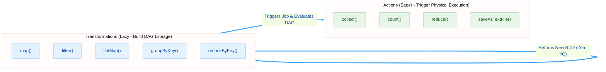
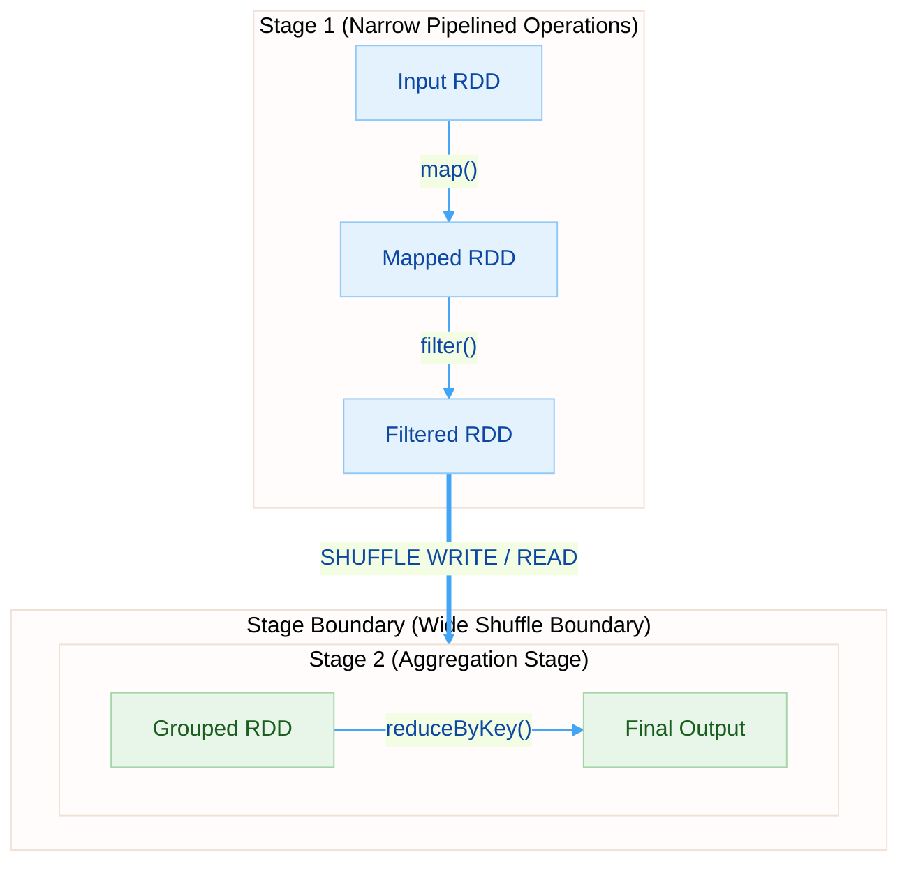
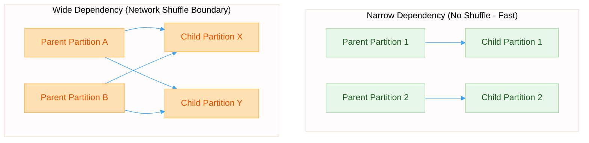
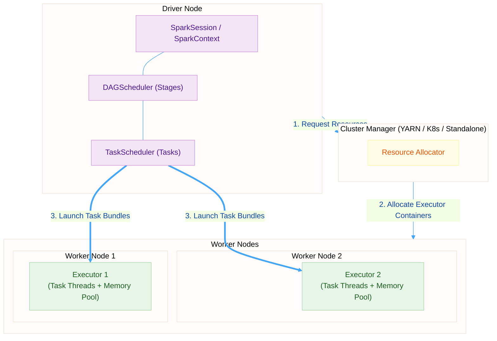

# Lecture 1.3: Apache Spark & Dataflow Graph Architectures

> [!info] COURSE & EXAM INFORMATION
> **Course:** [[00_Big_Data_Infrastructure_Index-v3|Big Data Computing]] (M.Sc. Computer Science - Sapienza University of Rome, A.Y. 2026/2027)
> **Instructor:** Prof. Gabriele Tolomei (tolomei@di.uniroma1.it)
> **Module Context:** This lecture explores the modern in-memory dataflow graph engine designed to replace disk-bound two-stage frameworks like [[Lecture_1_2_MapReduce-v3|MapReduce]] while preserving underlying scale-out storage integration with [[Lecture_1_1_Scaling_Out-v3#Hadoop Distributed File System (HDFS)|HDFS]].

---

## Lesson Roadmap
1. **[[#§ 1 — Beyond Two-Stage Pipelines|Beyond Two-Stage Pipelines]]** — [[Lecture_1_2_MapReduce-v3#Structural Limitations of MapReduce|MapReduce disk limitations]], [[#The Directed Acyclic Graph (DAG) Paradigm|DAG abstraction]], and [[#Direct Architectural Comparison: MapReduce vs Apache Spark|In-Memory vs Disk cost models]].
2. **[[#§ 2 — Resilient Distributed Datasets (RDDs)|Resilient Distributed Datasets (RDDs)]]** — Immutability, [[#RDD Partitions: The Unit of Parallelism|partitioning]], and [[#Memory Caching & Persistence Levels|in-memory persistence levels]].
3. **[[#§ 3 — Transformations vs Actions|Transformations vs Actions]]** — [[#Lazy Evaluation vs Eager Execution|Lazy evaluation semantics]] and [[#Complete PySpark Code Walkthrough|PySpark Word Count trace]].
4. **[[#§ 4 — Lazy Evaluation & DAG Stage Compilation|Lazy Evaluation & DAG Compilers]]** — Operator fusion and [[#DAG Stage Boundaries|stage decomposition]].
5. **[[#§ 5 — Narrow vs Wide Dependencies|Narrow vs Wide Dependencies]]** — [[#Narrow Dependencies (Pipeline Friendly)|Narrow dependencies]] vs [[#Wide Dependencies (Shuffle Required)|Wide shuffle boundaries]].
6. **[[#§ 6 — Lineage Tracking & Fault Recovery|Lineage & Fault Tolerance]]** — [[#Recomputing Lost Partitions On-Demand|Lineage graph recovery]] vs [[Lecture_1_1_Scaling_Out-v3#Rack-Aware Placement Strategy (3x Replication Factor)|3x physical replication]].
7. **[[#§ 7 — Execution Architecture Synthesis|Execution Architecture Synthesis]]** — [[#Driver Node Architecture|Driver]], [[#Cluster Manager Allocation|Cluster Manager]], [[#Executors and Task Threads|Executors]], and [[#Evolution Beyond RDDs: DataFrames & Spark SQL|DataFrames / Spark SQL]].

---

## § 1 — Beyond Two-Stage Pipelines

> [!quote] IN-MEMORY DATAFLOW REVOLUTION
> *"By keeping intermediate datasets resident in RAM and tracking how they were derived, Spark achieves up to 100x higher performance than MapReduce for iterative analytics."* — Zaharia et al. (UC Berkeley AMPLab, 2012).

### Structural Bottlenecks of Rigid MapReduce
As explored in [[Lecture_1_2_MapReduce-v3#Structural Limitations of MapReduce|Lecture 1.2]], MapReduce forces complex algorithms into concatenated two-stage jobs (`Map -> Reduce`). Every job boundary mandates writing intermediate state back to [[Lecture_1_1_Scaling_Out-v3#Hadoop Distributed File System (HDFS)|HDFS disk]], causing massive disk I/O, data serialization, and network replication overheads.

### The Directed Acyclic Graph (DAG) Paradigm
Apache Spark replaces rigid two-stage jobs with an arbitrary **Directed Acyclic Graph (DAG)** of operations:
- Nodes in the DAG represent **Distributed Datasets (RDDs)**.
- Edges in the DAG represent **Transformations** applied to data.
- Multiple operations are chained together in memory without intermediate disk writes.

### RAM Cost Models & Iterative Algorithms
Modern server clusters feature abundant RAM (e.g., 256 GB+ per node). Spark leverages memory residence to drastically alter computation cost dynamics:
- **Iterative Machine Learning:** Algorithms like Gradient Descent, PageRank, and K-Means execute hundreds of loops over identical datasets. Spark caches data in RAM once, avoiding $100\times$ disk read overheads.
- **Interactive Data Mining:** Analysts execute ad-hoc queries over cached in-memory datasets with sub-second latency.

```mermaid
%%{init: {'theme': 'base', 'themeVariables': { 'transparent': true, 'background': 'transparent', 'primaryColor': '#E3F2FD', 'primaryTextColor': '#0D47A1', 'primaryBorderColor': '#90CAF9', 'lineColor': '#42A5F5', 'fontFamily': 'arial'}}}%%
graph TD
    subgraph MapReducePipeline ["MapReduce Multi-Job Pipeline (Disk Heavy)"]
        MR1["Job 1 Map/Reduce"] -->|"Write Output to Disk"| H1[("HDFS Disk File 1")]
        H1 -->|"Read Input from Disk"| MR2["Job 2 Map/Reduce"]
        MR2 -->|"Write Output to Disk"| H2[("HDFS Disk File 2")]
    end

    subgraph SparkPipeline ["Spark In-Memory DAG Pipeline"]
        R1["Input RDD"] -->|"In-Memory Pipeline (Zero Disk)"| T1["Transformation 1"]
        T1 -->|"In-Memory Pipeline (Zero Disk)"| T2["Transformation 2"]
        T2 -->|"Action Trigger"| Result["Final Output"]
    end

    classDef mrStyle fill:#FFE0B2,stroke:#FFB74D,color:#E65100
    classDef sparkStyle fill:#E3F2FD,stroke:#90CAF9,color:#0D47A1

    class MR1,H1,MR2,H2 mrStyle
    class R1,T1,T2,Result sparkStyle
```



### Direct Architectural Comparison: MapReduce vs Apache Spark

| Metric / Dimension | [[Lecture_1_2_MapReduce-v3|Apache Hadoop MapReduce]] | [[Lecture_1_3_Spark-v3|Apache Spark Engine]] |
| :--- | :--- | :--- |
| **Data Processing Model** | Disk-bound batch processing | In-memory DAG dataflow |
| **Execution Abstraction** | Two-stage `Map` and `Reduce` UDFs | Flexible [[#Resilient Distributed Datasets (RDDs)|Resilient Distributed Datasets (RDDs)]] |
| **Intermediate State Storage** | Written to local disk (Map) & HDFS (Reduce) | Kept in **RAM** memory across stages |
| **Fault Tolerance Mechanism** | [[Lecture_1_1_Scaling_Out-v3#Rack-Aware Placement Strategy (3x Replication Factor)|Data Replication]] & Task Re-execution | [[#Lineage Graph & Fault Recovery|Lineage Re-computation]] (On-Demand) |
| **Iteration Performance** | Slow ($1\times$, disk bound) | Fast ($100\times$, memory cached) |
| **Optimization Engine** | None (Static job chain) | Dynamic [[#Lazy Evaluation & DAG Stage Compilation|DAG Scheduler]] & Operator Fusion |

### Checkpoint 1 — Motivation & Paradigm
> [!check] CONCEPTUAL CHECKPOINT
> 1. **Why does MapReduce suffer severe performance penalties during iterative Machine Learning?**
>    *Answer:* Because every iteration forces intermediate results to be serialized and written to HDFS disks, re-reading identical data on the next step.
> 2. **What does "Acyclic" mean in Directed Acyclic Graph (DAG)?**
>    *Answer:* Operations flow strictly forward from inputs to outputs without circular feedback loops inside the execution graph.
> 3. **How does RAM residence transform the economic cost model of Big Data computing?**
>    *Answer:* Memory reads operate at ~10-50 GB/s with microsecond latency, rendering analytics CPU-bound rather than disk I/O bottlenecked.
> 4. **What is the fundamental difference in fault tolerance strategy between MapReduce and Spark?**
>    *Answer:* MapReduce relies on physical 3x disk replication on HDFS; Spark tracks deterministic [[#Lineage Graph & Fault Recovery|Lineage Graphs]] to recompute lost partitions in RAM.

---

## § 2 — Resilient Distributed Datasets (RDDs)

The **Resilient Distributed Dataset (RDD)** is Spark's foundational abstraction.

> [!idea] DEFINITION OF AN RDD
> An RDD is a **read-only, partitioned collection of records** distributed across cluster machines that can be operated on in parallel.

### Core Properties of RDDs
1. **Immutable (Read-Only):** Once created, an RDD cannot be modified in-place. Transforming an RDD produces a brand new RDD.
2. **Partitioned:** Data is broken into logical **Partitions** spread across cluster nodes.
3. **Resilient (Fault-Tolerant):** Can rebuild lost partitions automatically using its derivation history ([[#Lineage Graph & Fault Recovery|Lineage]]).
4. **Lazy:** Computation only occurs when an **Action** explicitly requests output.

### RDD Partitions: The Unit of Parallelism
An RDD partition is the atomic chunk of data assigned to a single thread/task:
- When reading from HDFS, 1 RDD Partition corresponds by default to 1 HDFS Block (128 MB).
- Increasing partition count increases cluster parallelism; decreasing partition count reduces thread scheduling overhead.

### Creating RDDs
RDDs are instantiated via two primary mechanisms:
1. **Parallelizing an existing local collection:**
   `rdd = sc.parallelize([1, 2, 3, 4, 5], numSlices=4)`
2. **Referencing an external storage dataset ([[Lecture_1_1_Scaling_Out-v3#Hadoop Distributed File System (HDFS)|HDFS]], S3, local file):**
   `rdd = sc.textFile("hdfs://namenode:9000/data/logs.txt")`

### Memory Caching & Persistence Levels
Users can explicitly persist an RDD in memory using `.cache()` or `.persist(StorageLevel)`:

| Persistence Level | Storage Medium | CPU Overhead | Fault Recovery Cost |
| :--- | :--- | :--- | :--- |
| **`MEMORY_ONLY`** | In-Memory RAM (Deserialized Java Objects) | Very Low | High (Recompute via Lineage) |
| **`MEMORY_ONLY_SER`** | In-Memory RAM (Serialized Byte Array) | Moderate (Serialization cost) | High (Recompute via Lineage) |
| **`MEMORY_AND_DISK`** | RAM first; spills excess partitions to Disk | Low | Low (Spilled to local disk) |
| **`DISK_ONLY`** | Stored purely on local Worker Disks | High (Disk I/O) | Very Low |
| **`MEMORY_ONLY_2`** | In-Memory RAM replicated on 2 nodes | Very Low | Extremely Low (Duplicate node) |

### Checkpoint 2 — RDD Fundamentals
> [!check] CONCEPTUAL CHECKPOINT
> 1. **Why are RDDs designed to be strictly Immutable?**
>    *Answer:* Immutability ensures thread safety during parallel execution and guarantees that derivation history ([[#Lineage Graph & Fault Recovery|Lineage]]) remains deterministic for fault recovery.
> 2. **What determines the default partition count when loading a file from HDFS?**
>    *Answer:* The number of underlying 128 MB HDFS blocks constituting the input file.
> 3. **What is the trade-off between `MEMORY_ONLY` and `MEMORY_ONLY_SER` persistence levels?**
>    *Answer:* `MEMORY_ONLY` offers fastest CPU access but consumes large RAM footprints; `MEMORY_ONLY_SER` shrinks RAM usage via byte packing but incurs CPU serialization overhead.
> 4. **What happens when an RDD persisted as `MEMORY_ONLY` exceeds physical RAM capacity?**
>    *Answer:* Uncached partitions are evicted using Least Recently Used (LRU) policy and recomputed from Lineage on demand.

---

## § 3 — Transformations vs Actions

Spark strictly separates operations into **Transformations** and **Actions**.

### Lazy Evaluation vs Eager Execution
- **Transformations (Lazy):** Define new RDDs derived from existing RDDs. Executing a transformation returns a new RDD instance **without triggering physical computation or disk/network I/O**.
- **Actions (Eager):** Evaluate the accumulated DAG lineage and trigger physical cluster execution, returning final non-RDD results to the Driver or saving data to HDFS.



### Common Transformations & Actions Reference

| Operation Name | Category | Functional Semantics & Description |
| :--- | :--- | :--- |
| **`map(func)`** | Transformation | Passes each record through `func`, emitting a new RDD ($1 \to 1$). |
| **`filter(func)`** | Transformation | Selects elements where `func` evaluates to `True`. |
| **`flatMap(func)`** | Transformation | Passes each record through `func`, flattening returned iterators ($1 \to N$). |
| **`reduceByKey(func)`**| Transformation | Merges values sharing the same key using associative `func` (**Map-side combine**). |
| **`groupByKey()`** | Transformation | Groups values sharing the same key into an iterable list (**No Map-side combine**). |
| **`join(other)`** | Transformation | Performs an inner hash join over two Key-Value RDDs. |
| **`collect()`** | Action | Returns all elements of the RDD as an array to the Driver node (**RAM Risk!**). |
| **`count()`** | Action | Returns the total integer count of elements in the RDD. |
| **`reduce(func)`** | Action | Aggregates RDD elements globally using associative `func`. |
| **`saveAsTextFile(path)`**| Action | Writes RDD partitions to HDFS or local directory storage. |

### Complete PySpark Code Walkthrough

```python
from pyspark.sql import SparkSession

# Initialize Driver Session
spark = SparkSession.builder.appName("WordCountTrace").getOrCreate()
sc = spark.sparkContext

# 1. TRANSFORMATION: Define file read (Lazy - Builds RDD 1 metadata)
lines_rdd = sc.textFile("hdfs://namenode:9000/data/corpus.txt")

# 2. TRANSFORMATION: Split lines into individual words (Lazy - Builds RDD 2)
words_rdd = lines_rdd.flatMap(lambda line: line.split(" "))

# 3. TRANSFORMATION: Map each word to key-value pair (Lazy - Builds RDD 3)
pairs_rdd = words_rdd.map(lambda word: (word.lower(), 1))

# 4. TRANSFORMATION: Aggregate counts locally and shuffle (Lazy - Builds RDD 4)
counts_rdd = pairs_rdd.reduceByKey(lambda count1, count2: count1 + count2)

# 5. TRANSFORMATION: Filter out rare words (Lazy - Builds RDD 5)
frequent_rdd = counts_rdd.filter(lambda pair: pair[1] >= 10)

# 6. ACTION: Triggers DAG compilation, stages, and physical execution!
final_results = frequent_rdd.collect()

print("Top Frequent Words:", final_results[:5])
```

### Checkpoint 3 — Operations
> [!check] CONCEPTUAL CHECKPOINT
> 1. **Why does calling `map()` or `filter()` execute zero physical disk or network I/O?**
>    *Answer:* They are lazy transformations that merely append logical nodes to the internal RDD Lineage DAG in Driver memory.
> 2. **Which specific line in the PySpark trace triggers physical cluster execution?**
>    *Answer:* Line 6 calling `.collect()`, which is an eager Action.
> 3. **Why is calling `.collect()` on a multi-terabyte RDD dangerous?**
>    *Answer:* `.collect()` pulls all distributed partitions into the single Driver node's RAM, causing Out-Of-Memory (OOM) crashes.
> 4. **Why is `reduceByKey()` vastly superior to `groupByKey()` for aggregation?**
>    *Answer:* `reduceByKey()` performs local Map-side mini-combining before shuffling; `groupByKey()` transfers raw unaggregated lists across network links.

---

## § 4 — Lazy Evaluation & DAG Stage Compilation

Lazy evaluation allows Spark's **DAGScheduler** to inspect the global lineage graph and optimize execution plans prior to running tasks.

### Operator Fusion (Pipelining)
Without lazy evaluation, executing `map()` followed by `filter()` would require two separate passes over data. Spark's compiler performs **Operator Fusion**:
- Combines consecutive element-wise operations into a single CPU loop.
- Records are read from memory once, mapped, filtered, and written to output buffers in a single pass without intermediate memory allocation.

### DAG Decomposition into Stages
When an Action is invoked:
1. Driver submits RDD Lineage DAG to **DAGScheduler**.
2. DAGScheduler analyzes dependency types across RDD nodes.
3. DAGScheduler splits the graph into discrete **Stages** at every [[#Wide Dependencies (Shuffle Required)|Wide Dependency (Shuffle Boundary)]].
4. Each Stage contains a sequence of fully pipelined [[#Narrow Dependencies (Pipeline Friendly)|Narrow Transformations]].



### Checkpoint 4 — Lazy Evaluation
> [!check] CONCEPTUAL CHECKPOINT
> 1. **Explain the concept of Operator Fusion in Spark's compiler.**
>    *Answer:* It merges consecutive narrow transformations (`map` -> `filter`) into a single CPU loop pass over data records.
> 2. **What architectural element forces the creation of a new Stage boundary?**
>    *Answer:* A [[#Wide Dependencies (Shuffle Required)|Wide Dependency]] requiring an all-to-all network shuffle.
> 3. **How does lazy evaluation prevent unnecessary computation?**
>    *Answer:* If a user calls `textFile()` -> `map()` -> `take(5)`, Spark reads only enough blocks to fulfill the 5 requested records rather than scanning the entire terabyte file.

---

## § 5 — Narrow vs Wide Dependencies

The distinction between **Narrow** and **Wide** dependencies is the single most critical performance concept in Spark architecture.

### Narrow Dependencies (Pipeline Friendly)
A dependency is **Narrow** if each partition of the parent RDD is used by at most **one** partition of the child RDD:
$$\text{Parent Partition } P_i \implies \text{Child Partition } C_j \quad (1 \text{ to } 1 \text{ or } N \text{ to } 1)$$
- *Examples:* `map()`, `filter()`, `flatMap()`, `union()`, `coalesce()`.
- *Performance:* Executed in parallel within the same worker thread via in-memory streaming. **Zero network shuffle required!**

### Wide Dependencies (Shuffle Required)
A dependency is **Wide** if multiple child partitions depend on data from a single parent partition:
$$\text{Parent Partition } P_i \implies \text{Multiple Child Partitions } C_1, C_2, \dots, C_k \quad (1 \text{ to } M)$$
- *Examples:* `groupByKey()`, `reduceByKey()`, `join()`, `repartition()`.
- *Performance:* Forces an all-to-all network **Shuffle Phase** where workers write intermediate map files to disk and fetch partition blocks over the network.



### Checkpoint 5 — Dependencies
> [!check] CONCEPTUAL CHECKPOINT
> 1. **What is the formal definition of a Narrow Dependency?**
>    *Answer:* Each parent partition is consumed by at most one child partition.
> 2. **Why do Narrow Dependencies permit in-memory pipelining?**
>    *Answer:* Data records stay local to the same thread and partition buffer without waiting for external node transfers.
> 3. **Why is `join()` considered a Wide Dependency by default?**
>    *Answer:* Joining two datasets requires shuffling records sharing identical join keys to the same physical partition node.

---

## § 6 — Lineage Tracking & Fault Recovery

Spark achieves fault tolerance without physical 3x disk replication by tracking derivation metadata in an **RDD Lineage Graph**.

### Recomputing Lost Partitions On-Demand
When a worker node holding Partition 2 of RDD 3 crashes:
1. Executor notifies Driver of missing partition.
2. Driver consults the RDD Lineage Graph to locate Partition 2's exact parent derivation path (`HDFS Block 2 -> RDD 1 -> RDD 2 -> RDD 3`).
3. Driver reschedules a task to recompute **only Partition 2** on a healthy worker.
4. Unaffected partitions remain untouched in RAM!

```mermaid
%%{init: {'theme': 'base', 'themeVariables': { 'transparent': true, 'background': 'transparent', 'primaryColor': '#E3F2FD', 'primaryTextColor': '#0D47A1', 'primaryBorderColor': '#90CAF9', 'lineColor': '#42A5F5', 'fontFamily': 'arial'}}}%%
graph LR
    HDFS_Block["HDFS Source Block 2"] -->|"map()"| RDD1["RDD 1 (Partition 2)"]
    RDD1 -->|"filter()"| RDD2["RDD 2 (Lost Partition 2!)"]
    RDD2 -->|"reduceByKey()"| RDD3["RDD 3 (Partition 2)"]

    RDD2 -.->"Recompute Lost Partition 2 Only<br/>(Re-run map + filter on HDFS Block 2)"| RDD1

    classDef normalStyle fill:#E3F2FD,stroke:#90CAF9,color:#0D47A1
    classDef lostStyle fill:#FFEBEE,stroke:#EF9A9A,color:#C62828

    class HDFS_Block,RDD1,RDD3 normalStyle
    class RDD2 lostStyle
```

### Physical Replication vs Lineage Fault Tolerance

| Strategy Aspect | Physical Replication ([[Lecture_1_1_Scaling_Out-v3#Hadoop Distributed File System (HDFS)|GFS/HDFS]]) | Lineage Graph ([[Lecture_1_3_Spark-v3|Apache Spark]]) |
| :--- | :--- | :--- |
| **Storage Overhead** | $200\%$ Extra Storage ($3\times$ total size) | **$0\%$ Extra Storage** (Metadata graph only) |
| **Write Overhead** | High (Network replication writes) | Very Low (Appending graph node) |
| **Recovery Mechanism** | Fetch pre-cloned copy from alternative node | Re-execute deterministic transformations in RAM |

### The Role of Checkpointing
For extremely long iterative lineages (e.g., 1,000 Gradient Descent loops):
- Recomputing a lost partition from raw source data would require re-running 1,000 derivation steps!
- **Checkpointing (`rdd.checkpoint()`)** truncates lineage by saving RDD contents to durable HDFS storage, allowing recovery to start from the checkpoint file.

### Checkpoint 6 — Lineage & Recovery
> [!check] CONCEPTUAL CHECKPOINT
> 1. **How does Spark recover a lost RDD partition without 3x data replication?**
>    *Answer:* By consulting the Lineage Graph and re-executing deterministic transformations on the raw input block for that partition only.
> 2. **Why is Lineage recovery fast for Narrow Dependencies but costly for Wide Dependencies?**
>    *Answer:* Narrow recovery recomputes a single partition lineage path; Wide recovery may require re-running shuffle outputs across all parent partitions.
> 3. **When should a developer explicitly call `rdd.checkpoint()`?**
>    *Answer:* In deep iterative algorithms (e.g., PageRank loops) to prevent lineage graphs from growing infinitely large.

---

## § 7 — Execution Architecture Synthesis

A production Spark cluster operates via a master-worker topology managed by a **Driver Node** and **Executors**.



### Core Architecture Components
- **Driver Node:** Hosts user's `main()` program, constructs `SparkContext`, compiles DAG into Stages, and schedules physical tasks.
- **Cluster Manager:** External service (YARN, Kubernetes, or Standalone) allocating worker containers.
- **Executors:** Worker processes hosting task execution threads and in-memory RDD cache blocks.

### Evolution Beyond RDDs: DataFrames & Spark SQL
While RDDs provide powerful low-level control:
- They lack schema awareness, treating data as untyped Java/Python objects.
- Spark cannot optimize user code inside opaque lambda functions (`lambda x: x + 1`).
- Modern Spark uses **DataFrames** and **Datasets** powered by the **Catalyst Optimizer** and **Tungsten Engine** to automatically optimize query plans and generate off-heap binary code.

---

> [!summary] KEY TAKEAWAYS & EXECUTIVE SYNTHESIS
> - **In-Memory DAG Processing:** Spark eliminates intermediate HDFS disk writes, executing arbitrary operation graphs in memory for up to $100\times$ speedups.
> - **Resilient Distributed Datasets (RDDs):** Immutable, partitioned, read-only collections that recover from failures via deterministic Lineage Graph derivation.
> - **Lazy Evaluation:** Transformations (`map`, `filter`) accumulate lineage metadata without I/O; Actions (`collect`, `saveAsTextFile`) compile and execute physical DAGs.
> - **Narrow vs Wide Dependencies:** Narrow operations (`map`, `filter`) pipeline in memory without network traffic; Wide operations (`reduceByKey`, `join`) force expensive network shuffles and Stage boundaries.
> - **Lineage Fault Recovery:** Lost RDD partitions are recomputed on-demand from parent lineage graphs, eliminating $200\%$ physical storage replication overheads.
> - **Unified Runtime Architecture:** Driver node compiles DAG into Stages, submits task bundles to Cluster Manager (YARN/K8s), and executes across parallel worker Executor threads.
