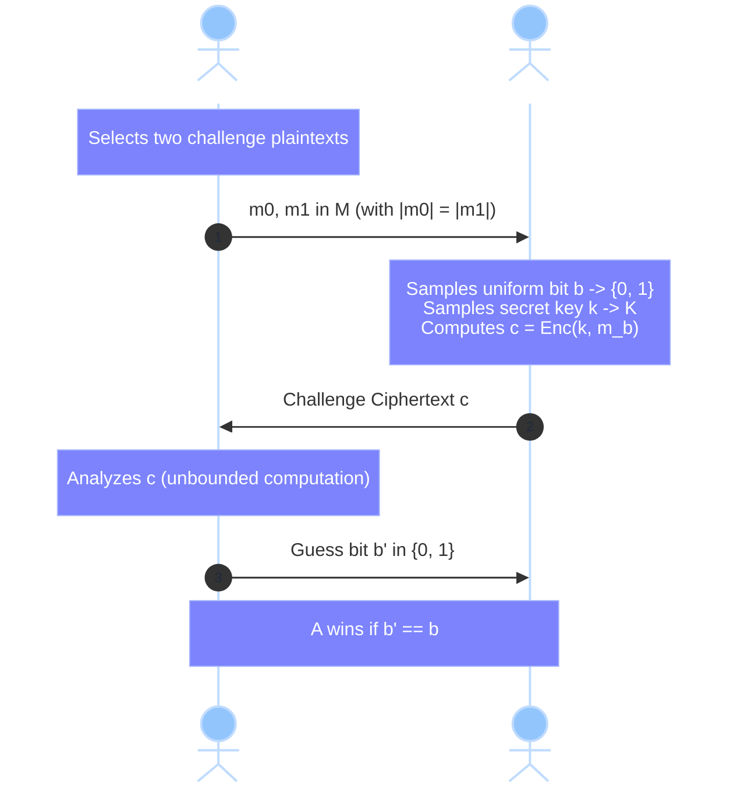
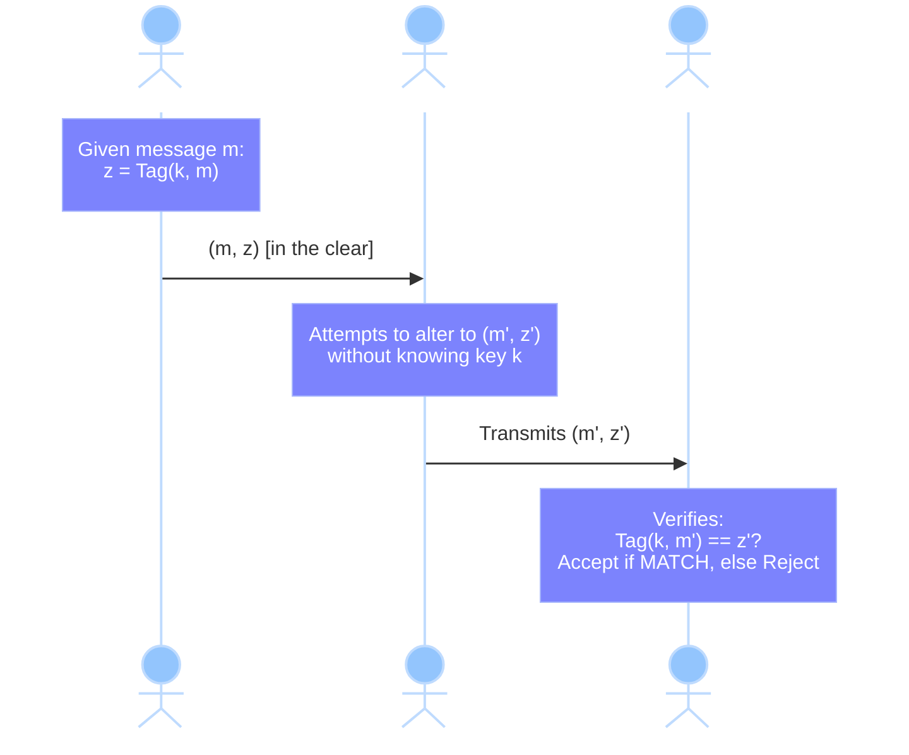
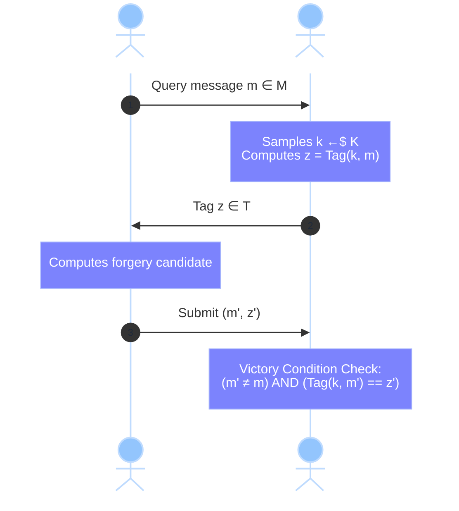

> [!ABSTRACT] Context & Starting Point
> 
> This section picks up immediately after the proof of [[Lecture 1 - Unconditional Security & Perfect Secrecy#3. Theorem Equivalent Formulations of Perfect Secrecy|Shannon's Theorem]] and the fundamental constraints of the _One-Time Pad_ (OTP) under _Perfect Secrecy_:
> 
>   
> 
> 1. $\lvert \mathcal{K} \rvert \ge \lvert \mathcal{M} \rvert$ (the secret key must be at least as long as the plaintext space).
>     
>       
>     
> 2. The key can be used **only once** (reusing the key leaks plaintext relations: $c_1 \oplus c_2 = m_1 \oplus m_2$).
>     
>       
>     
> 
> **Core Take-Away from Lecture Notes:**
> 
> _«We shall do something different! Our goal: Alice and Bob share 1 key of length independent of the length of the message.»_
> 
>   
> 
> This paradigm shift motivates both computational confidentiality and the study of **data integrity and origin authentication** using **Message Authentication Codes (MACs)**.
> 
>   

## 1. Game-Based Formulation of Perfect Secrecy

In modern cryptographic frameworks, security definitions are framed as interactive experiments (**games**) between an **honest Challenger** $\mathcal{C}$ and an **Adversary** $\mathcal{A}$, rather than relying solely on classical Bayesian posterior probabilities.




### 1.1 The Experiment: $\text{GAME}_{\Pi, \mathcal{A}}(b)$

Let $\Pi = (\text{Enc}, \text{Dec})$ be a symmetric encryption scheme over key space $\mathcal{K}$, message space $\mathcal{M}$, and ciphertext space $\mathcal{C}$:

1. **Query Phase**: The adversary $\mathcal{A}$ chooses any two distinct messages $m_0, m_1 \in \mathcal{M}$ such that $\vert{}m_0\vert{} = \vert{}m_1\vert{}$ and submits them to the Challenger.
2. **Challenge Phase**:
    - The Challenger samples a secret bit $b \in \{0, 1\}$.
    - The Challenger draws a key uniformly at random: $k \in \mathcal{K}$.
    - The Challenger evaluates $c = \text{Enc}(k, m_b)$ and returns $c$ to $\mathcal{A}$.
3. **Guess Phase**: $\mathcal{A}$ inspects $c$ and outputs a guess $b' \in \{0, 1\}$.

> [!DEFINITION] Definition: Game-Based Perfect Secrecy
> 
> A cipher $\Pi = (\text{Enc}, \text{Dec})$ achieves **Perfect Secrecy (PS)** if and only if for every adversary $\mathcal{A}$ (even with unbounded computational power) and for all message pairs $m_0, m_1 \in \mathcal{M}$:
> 
>   
> 
> $$\Pr\left[b' = 1 \;\middle\vert{}\; \text{GAME}_{\Pi, \mathcal{A}}(0, m_0, m_1)\right] - \Pr\left[b' = 1 \;\middle\vert{}\; \text{GAME}_{\Pi, \mathcal{A}}(1, m_0, m_1)\right] = 0$$
> 
> Or equivalently:
> 
>   
> 
> $$\Pr\left[\text{GAME}_{\mathcal{A}}(0) = 1\right] = \Pr\left[\text{GAME}_{\mathcal{A}}(1) = 1\right]$$

> [!NOTE] Equivalence with Shannon's Definition
> 
> Since $\Pr[\text{Enc}(k, m_0) = c] = \Pr[\text{Enc}(k, m_1) = c]$ for every $c \in \mathcal{C}$, the probability distribution of the ciphertext is completely independent of the selected plaintext $m_b$. No algorithm can bias its decision $b'$ based on observing $c$.
> 
>   

## 2. Integrity & Authentication: Message Authentication Codes (MAC)

Confidentiality (_secrecy_) protects against passive eavesdropping (_Eve_ reading the wire). However, real-world communication links are vulnerable to **active adversaries** capable of:
- Modifying transmitted payloads.
- Injecting forged transmissions.
- Replaying obsolete messages.

To guarantee **data integrity** and **origin authentication**, we use **Message Authentication Codes (MACs)**.



### 2.1 Formal Syntax

A Message Authentication Code over key space $\mathcal{K}$, message space $\mathcal{M}$, and tag space $\mathcal{T}$ is defined by a pair of algorithms:

- **Tag Generation**: $\text{Tag}: \mathcal{K} \times \mathcal{M} \to \mathcal{T}$ (deterministic in standard unconditionally secure settings).
- **Verification**: $\text{Ver}: \mathcal{K} \times \mathcal{M} \times \mathcal{T} \to \{\text{Accept}, \text{Reject}\}$.
$$\text{Ver}(k, m, \tau) = \begin{cases} \text{Accept} & \text{if } \tau = \text{Tag}(k, m) \\ \text{Reject} & \text{otherwise} \end{cases}$$
## 3. Statistical Security: One-Time MAC Model

In information-theoretic cryptography, we examine the **One-Time MAC** setting:

1. The adversary Eve observes **one** legitimate message-tag pair $(m, \tau)$, where $\tau = \text{Tag}(k, m)$.
2. Her objective is to construct a valid **forgery**: an authentic pair $(m', \tau')$ such that $m' \neq m$, without having access to $k$.



### 3.1 Formal Definition: $\epsilon$-Statistical Security

> [!DEFINITION] Definition: $\epsilon$-Statistically Secure MAC
> 
> A MAC scheme $\text{Tag}: \mathcal{K} \times \mathcal{M} \to \mathcal{T}$ is **$\epsilon$-statistically secure** against 1-message forgery if for all distinct pairs $m \neq m' \in \mathcal{M}$ and all candidate tags $\tau, \tau' \in \mathcal{T}$:
> 
>   
> 
> $$\Pr\left[ \text{Tag}(k, m') = \tau' \;\middle\vert{}\; \text{Tag}(k, m) = \tau \right] \le \epsilon$$
> 
> Where the probability is evaluated over the uniform choice of $k \in \mathcal{K}$.
> 
>   

In real-world cryptographic applications, typical target parameters are negligible quantities:
$$\epsilon \in \left\{2^{-80}, 2^{-128}\right\}$$

## 4. Fundamental Theoretical Limits & Pitfalls

### 4.1 Impossibility of Zero-Error Authentication ($\epsilon = 0$)

> [!WARNING]- Classroom Exercise: Why $\epsilon$-Security is Impossible for $\epsilon = 0$
> 
> **Claim**: It is impossible to achieve unconditional integrity with zero forgery probability ($\epsilon = 0$) over any finite tag space.
> 
>   
> 
> **Proof**:
> 
>   
> 
> Let $\mathcal{T}$ be a non-empty, finite tag space ($\vert{}\mathcal{T}\vert{} < \infty$).
> 
>   
> 
> Fix an observed valid pair $(m, \tau)$ and an arbitrary target message $m' \neq m$. Define the subset of candidate keys compatible with the transcript:
> 
>   
> 
> $$\mathcal{K}_{(m, z)} = \left\{ k \in \mathcal{K} : \text{Tag}(k, m) = z
> \tau \right\} \neq \emptyset$$
> 
> For each key $k \in \mathcal{K}_{(m, \tau)}$, the evaluation $\text{Tag}(k, m')$ must land in the finite set $\mathcal{T}$.
> 
>   
> 
> By the law of total probability over the finite space $\mathcal{T}$:
> 
>   
> 
> $$\sum_{\tilde{\tau} \in \mathcal{T}} \Pr\left[ \text{Tag}(k, m') = \tilde{z} \;\middle\vert{}\; \text{Tag}(k, m) = \tau \right] = 1$$
> 
> By the averaging principle (pigeonhole principle), there exists at least one tag candidate $z^* \in \mathcal{T}$ such that:
> 
>   
> 
> $$\Pr\left[ \text{Tag}(k, m') = \tau^* \;\middle\vert{}\; \text{Tag}(k, m) = z \right] \ge \frac{1}{\vert{}\mathcal{T}\vert{}} > 0$$
> 
> Consequently, an attacker who simply guesses $\tau^*$ (or samples uniformly at random from $\mathcal{T}$) succeeds with probability at least $\frac{1}{\vert{}\mathcal{T}\vert{}}$. Hence:
> 
>   
> 
> $$\epsilon \ge \frac{1}{\vert{}\mathcal{T}\vert{}} > 0$$
> 
> Therefore, $\epsilon = 0$ is strictly unattainable.
> 
>   

### 4.2 OTP is Insecure for Authentication (Malleability)

> [!CAUTION]- Counterexample: Tag(k, m) = m ⊕ k is Catastrophically Broken
> 
> Consider the naive candidate $\text{Tag}(k, m) = m \oplus k$:
> 
>   
> 
> - Eve observes $(m, \tau)$ where $\tau = m \oplus k$.
>     
>       
>     
> - Eve recovers the secret key immediately:
>     
>       
>     
>     $$k = \tau \oplus m$$
>     
> - Once $k$ is known, Eve can forge valid tags for any message $m' \neq m$:
>     
>       
>     
>     $$z' = m' \oplus k = m' \oplus (\tau \oplus m)$$
>     
> 
> Even without recovering $k$, the **linearity** of the XOR operation makes forgery trivial:
> 
>   
> 
> $$\text{Tag}(k, m \oplus \Delta) = (m \oplus \Delta) \oplus k = (m \oplus \tau) \oplus \Delta = \tau \oplus \Delta$$
> 
> Eve can flip any bit pattern $\Delta$ in the message and apply the exact same $\Delta$ to the tag, achieving successful forgery with **probability 1**.
> 
>   

## 5. Construction via Pairwise Independent Hash Families

To construct optimal one-time MACs against computationally unbounded adversaries, we employ **Pairwise Independent Hash Families** (_strongly 2-universal families_).
### 5.1 Definition: Pairwise Independence

Let $\mathcal{H} = \{h_k : \mathcal{M} \to \mathcal{T}\}_{k \in \mathcal{K}}$ be a family of hash functions.

> [!DEFINITION] Definition: Strongly 2-Universal / Pairwise Independent
> 
> $\mathcal{H}$ is **pairwise independent** if for every pair of distinct messages $m \neq m' \in \mathcal{M}$ $$(h_k(m), h_k(m'))$$ with $k$ uniform over $\mathcal{K}$, is uniform over $\mathcal{T}^2 = \mathcal{T} \times \mathcal{T}$
> 
This suggest doing $$\text{Tag}(K,m)=h(k,m)=h_k(m)$$
> 

//

### 5.2 Security Bound Analysis

Define the authentication algorithm by $\text{Tag}(k, m) := h_k(m)$ for $h_k \in \mathcal{H}$.

Using the definition of conditional probability:

  

$$\begin{aligned} \Pr\left[ \text{Tag}(k, m') = z' \;\middle\vert{}\; \text{Tag}(k, m) = z \right] &= \frac{\Pr\left[ h_k(m) = z \;\land\; h_k(m') = z' \right]}{\Pr\left[ h_k(m) = z \right]} \\ &= \frac{\frac{1}{\vert{}\mathcal{T}\vert{}^2}}{\frac{1}{\vert{}\mathcal{T}\vert{}}} = \frac{1}{\vert{}\mathcal{T}\vert{}} \end{aligned}$$

> [!THEOREM] Theorem: Theoretical Optimality
> 
> A MAC instantiated from a pairwise independent hash family achieves the optimal theoretical bound:
> 
>   
> 
> $$\epsilon = \frac{1}{\vert{}\mathcal{T}\vert{}}$$
> 
> Learning the authentication tag of one message provides an attacker with zero statistical advantage toward predicting the tag of any other message.
> 
>   

## 6. Concrete Construction: The Affine Family over $\mathbb{F}_p$

The lecture details the classic Carter-Wegman affine construction using degree-1 polynomials over a finite prime field $\mathbb{F}_p$.

  

Snippet di codice

```
%%{init: {'theme': 'base', 'themeVariables': { 'primaryColor': '#FCE8E6', 'primaryBorderColor': '#EA4335', 'primaryTextColor': '#202124', 'lineColor': '#5F6368'}}}%%
graph TD
    Params["Parameters:<br/>p = Large prime (λ bits)"] --> Spaces
    Spaces["Spaces:<br/>M = F_p,  T = F_p<br/>Key k = (a, b) ∈ F_p × F_p"] --> Evaluation
    Evaluation["Tag Evaluation:<br/>Tag((a, b), m) = (a · m + b) mod p"] --> Security
    Security["Resulting Security:<br/>ε = 1 / p = 2^(-λ)"]

    style Params fill:#F3F4F6,stroke:#9CA3AF,stroke-width:1px
    style Spaces fill:#FEF7E0,stroke:#FBBC04,stroke-width:1px
    style Evaluation fill:#E8F0FE,stroke:#4285F4,stroke-width:1px
    style Security fill:#E6F4EA,stroke:#34A853,stroke-width:1px
```

### 6.1 Scheme Parameters

- **Prime field**: Choose a prime $p$ of bit-length $\lambda$ (e.g., $\lambda = 128$).
    
      
    
- **Message space**: $\mathcal{M} = \mathbb{F}_p = \{0, 1, \dots, p - 1\}$.
    
      
    
- **Tag space**: $\mathcal{T} = \mathbb{F}_p$.
    
      
    
- **Key space**: $\mathcal{K} = \mathbb{F}_p \times \mathbb{F}_p$ (the key is a pair $k = (a, b)$ sampled uniformly at random).
    
      
    
- **Tag function**:
    
      
    
    $$\text{Tag}((a, b), m) = h_{a, b}(m) = (a \cdot m + b) \pmod p$$
    

### 6.2 Formal Proof of Pairwise Independence

> [!THEOREM] Algebraic Proof
> 
> Fix two arbitrary distinct messages $m \neq m' \in \mathbb{F}_p$ and two candidate tags $z, z' \in \mathbb{F}_p$.
> 
>   
> 
> The condition that $h_{a,b}(m) = z$ and $h_{a,b}(m') = z'$ forms a linear system of two equations in two unknowns $(a, b)$ over the field $\mathbb{F}_p$:
> 
>   
> 
> $$\begin{cases} a \cdot m + b \equiv z \pmod p \\ a \cdot m' + b \equiv z' \pmod p \end{cases}$$
> 
> In matrix form:
> 
>   
> 
> $$\begin{pmatrix} m & 1 \\ m' & 1 \end{pmatrix} \begin{pmatrix} a \\ b \end{pmatrix} \equiv \begin{pmatrix} z \\ z' \end{pmatrix} \pmod p$$
> 
> The determinant of the coefficient matrix is:
> 
>   
> 
> $$\det = m \cdot 1 - m' \cdot 1 = m - m' \pmod p$$
> 
> Because $m \neq m'$ and $\mathbb{F}_p$ is a field, $m - m' \not\equiv 0 \pmod p$.
> 
>   
> 
> The determinant is invertible modulo $p$, which means the matrix is non-singular.
> 
>   
> 
> By Cramer's Rule, there exists **exactly one unique solution** $(a, b) \in \mathbb{F}_p \times \mathbb{F}_p$:
> 
>   
> 
> $$\begin{cases} a \equiv (z - z') \cdot (m - m')^{-1} \pmod p \\ b \equiv z - a \cdot m \pmod p \end{cases}$$
> 
> Since the key pair $(a, b)$ is chosen uniformly at random among $\vert{}\mathcal{K}\vert{} = p^2$ equally likely outcomes:
> 
>   
> 
> $$\Pr_{a, b \xleftarrow{\$} \mathbb{F}_p}\left[ h_{a,b}(m) = z \;\land\; h_{a,b}(m') = z' \right] = \frac{1}{p^2} = \frac{1}{\vert{}\mathcal{T}\vert{}^2}$$
> 
> Thus, the affine family is **strictly pairwise independent**.
> 
>   

### 6.3 Security Parameter Evaluation

From pairwise independence, the probability of an active forgery attempt succeeds with:

  

$$\Pr\left[ \text{Tag}(k, m') = z' \;\middle\vert{}\; \text{Tag}(k, m) = z \right] = \frac{1/p^2}{1/p} = \frac{1}{p}$$

Setting $p \approx 2^{128}$ gives an attacker success probability bounded by:

  

$$\epsilon \approx 2^{-128}$$

## 7. Comparative Summary: Secrecy vs. Integrity

> [!SUMMARY] Conceptual Comparison
> 
> |**Criterion**|**Confidentiality (OTP / Perfect Secrecy)**|**Integrity / Origin (1-Time Statistical MAC)**|
> |---|---|---|
> |**Primary Goal**|Prevent unauthorized reading (_Confidentiality_)|Prevent undetected modification/forgery (_Integrity_)|
> |**Channel Visibility**|Ciphertext $c$ hides message $m$|Message $m$ and tag $z$ can travel completely in the clear|
> |**Key Reuse**|Forbidden (One-Time pad)|Forbidden (One-Time for affine/pairwise MACs)|
> |**Shannon Bound**|$\lvert \mathcal{K} \rvert \ge \lvert \mathcal{M} \rvert$|Not constrained by Shannon's theorem ($\lvert \mathcal{K} \rvert = p^2$ for $\lvert \mathcal{M} \rvert = p$)|
> |**Security Level**|Perfect ($\epsilon = 0$ information leaked)|Statistical optimum ($\epsilon = \frac{1}{\lvert \mathcal{T} \rvert} > 0$, $\epsilon = 0$ is impossible)|