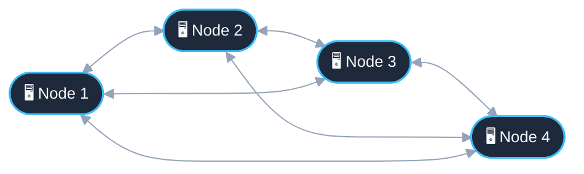

## 1. Architectural Comparison: Client-Server vs. Distributed Systems

### Centralized Architecture (Client-Server)
In a traditional client-server architecture, multiple clients communicate directly with a single centralized server.

- **Main Limitations:**
  - **Limited Scalability:** Does not scale horizontally under heavy, growing workloads.
  - **Single Point of Failure (SPOF):** If the central server crashes, the entire system becomes unavailable.
  - **Geographical Latency:** Physical distance between clients and the central node introduces unavoidable network delays.

### Distributed Architecture (Distributed Systems)
The infrastructure is decentralized, consisting of a network of cooperating independent nodes (e.g., banking systems, distributed database clusters, multi-region cloud services).

- **Advantages:**
  - **Horizontal Scalability:** Nodes can be dynamically added to accommodate load.
  - **Resilience & Fault Tolerance:** Failure of individual nodes does not bring down the entire system.
  - **Geographical Distribution:** Servers are placed closer to end-users to minimize latency.

> [!danger] Core Challenges in Distributed Systems
> 1. **Order of Operations:** In the absence of a synchronized global physical clock, determining causal and temporal relationships between events is non-trivial.
> 2. **Unreliable Message Passing:** Coordination relies strictly on exchanging messages over a network, but messages may be delayed, duplicated, or lost.
> 3. **Deterministic Coordination:** *Can we coordinate servers with a protocol consisting of a finite number of steps (messages) over an unreliable channel?*

---

## 2. The Two Generals' Problem

> [!abstract] Problem Statement
> Two allied armies, led by General 1 ($G_1$) and General 2 ($G_2$), are positioned on two hills separated by an enemy valley. They must attack simultaneously to conquer the enemy; if only one attacks, they will be defeated. Communication is only possible via messengers who must cross the valley and risk being captured.
> 
> **Question:** Is there a deterministic protocol with a finite number of messages that guarantees both generals agree to attack?

> [!failure] Impossibility Result
> **No.** It is formally impossible to reach consensus deterministically over an unreliable communication channel using a finite number of messages. Any proposed final message requires an acknowledgment ($ACK$), which itself requires an acknowledgment ($ACK\text{-to-}ACK$), leading to an infinite regress of uncertainty.

---

## 3. System Models & Taxonomy

A distributed system is characterized across three fundamental dimensions: **Network Timing**, **Channel Reliability**, and **Process Failure Modes**.

### A. Network Timing Models

- **Synchronous Model:**
  - There exists a known, fixed upper bound $\Delta$ on message delivery delay:
    $$
    \Delta t_{\text{delivery}} \le \Delta < \infty
    $$
  - Process execution speed and clock drift rates are bounded and known.
- **Asynchronous Model:**
  - **No upper bound** exists on message transmission delays or process execution speeds.
  - A message sent will eventually arrive (if the channel does not lose it), but no assumptions can be made about *when*.
  - **Consequence:** It is impossible to distinguish with certainty between a process that is running extremely slowly and one that has crashed.

### B. Communication Channel Models

Communication properties between processes $P_i$ and $P_j$:

| Channel Model | Message Loss | Duplication | Reordering | Delivery Guarantee |
| :--- | :--- | :--- | :--- | :--- |
| **Arbitrary / Unreliable** | Yes | Yes | Yes | No delivery guarantees whatsoever. |
| **Fair-Loss Channel** | Yes (transient) | No | Yes (or FIFO) | If a message is sent infinitely many times, it will be delivered at least once (messages are not lost indefinitely). |
| **Reliable Channel** | No | No | FIFO / Causal | Atomic and ordered: every message sent by a correct process is delivered exactly once to the recipient. |

### C. Process Failure Models

1. **Crash-Stop (Fail-Stop):**
   - A process halts execution abruptly and permanently (irreversible terminal state).
2. **Crash-Recovery (Fail-Recovery):**
   - A process crashes, but can later recover, restore persistent local state (e.g., via Write-Ahead Logs), and resume participation in the protocol (*self-healing*).
3. **Byzantine (Arbitrary / Malicious):**
   - Processes can exhibit arbitrary, rogue, or malicious behavior (e.g., sending contradictory messages to different peers, corrupting data, colluding).

---

## 4. The FLP Impossibility Theorem (Fischer, Lynch, Paterson - 1985)

> [!theorem] FLP Impossibility Result
> In a **purely asynchronous** distributed system with **deterministic** processes, the **Consensus** problem cannot be solved if even a **single process** is subject to unannounced **Crash-Stop** failure.
> 
> $$
> \text{Asynchronous} + \text{Deterministic} + \text{1 Crash-Stop Failure} \implies \text{No Guaranteed Consensus}
> $$

### The Two Fundamental Properties of Distributed Consensus

Any viable consensus protocol must satisfy:

- **Safety ("Nothing bad happens"):**
  - No two correct processes decide on conflicting or incompatible values.
  - *Two Generals example:* "Either both generals attack at the same time, or neither attacks."
- **Liveness ("Something good eventually happens"):**
  - The system makes forward progress and eventually reaches a decision.
  - *Two Generals example:* "The generals do not remain undecided indefinitely."

> [!note] Fundamental Trade-off
> FLP proves that in asynchronous systems with possible failures, no deterministic consensus protocol can simultaneously guarantee both strict **Safety** and guaranteed **Liveness** under all circumstances.

---

## 5. Local State, Global State, and Inconsistent Snapshots

In a system of processes $P_1, P_2, \dots, P_n$, each process undergoes a sequence of local events:

$$
e_i^1, e_i^2, e_i^3, \dots
$$

![[Drawing 2026-09-26 14.16.31.excalidraw 1.svg]]
### Formal Definitions

> [!definition] Local State ($S_i$)
> The internal state of process $P_i$ immediately following the occurrence of event $e_i^k$:
> 
> $$
> S_i = \sigma(e_i^1, e_i^2, \dots, e_i^k)
> $$

> [!definition] Global State ($S_{\text{global}}$)
> The combination of the local states of all participating processes along with the messages currently in transit across the communication channels $\mathcal{C}$:
> 
> $$
> S_{\text{global}} = \big(S_1, S_2, \dots, S_n, \mathcal{C}\big)
> $$

### Phantom Deadlocks & The Snapshot Problem

Because communication delays vary across channels, recording local states asynchronously at different times can yield a globally inconsistent view of the system.

> [!warning] The Phantom Deadlock Paradox
> - **From the observer's viewpoint:** Assembling unsynchronized local snapshots reveals a circular wait dependency ($P_1 \leftrightarrow P_2$), indicating a deadlock.
> - **In actual system reality:** By the time $P_1$ entered the waiting state, $P_2$ had already completed its operation and released the resource. **No actual deadlock ever occurred!**
> - **Takeaway:** A naive global state captured without causal consistency reflects a configuration that the system may never have occupied. This establishes the need for coordinated distributed snapshot algorithms (e.g., Chandy-Lamport).

---

## References & Next Steps

- [[Chandy-Lamport-Algorithm]] — Distributed snapshot algorithm for consistent global cuts
- [[Lamport-Logical-Clocks]] — Logical time and partial ordering of events in asynchronous systems
- [[Paxos-and-Raft]] — Practical consensus protocols that bypass FLP by relaxing strict liveness guarantees during network instability