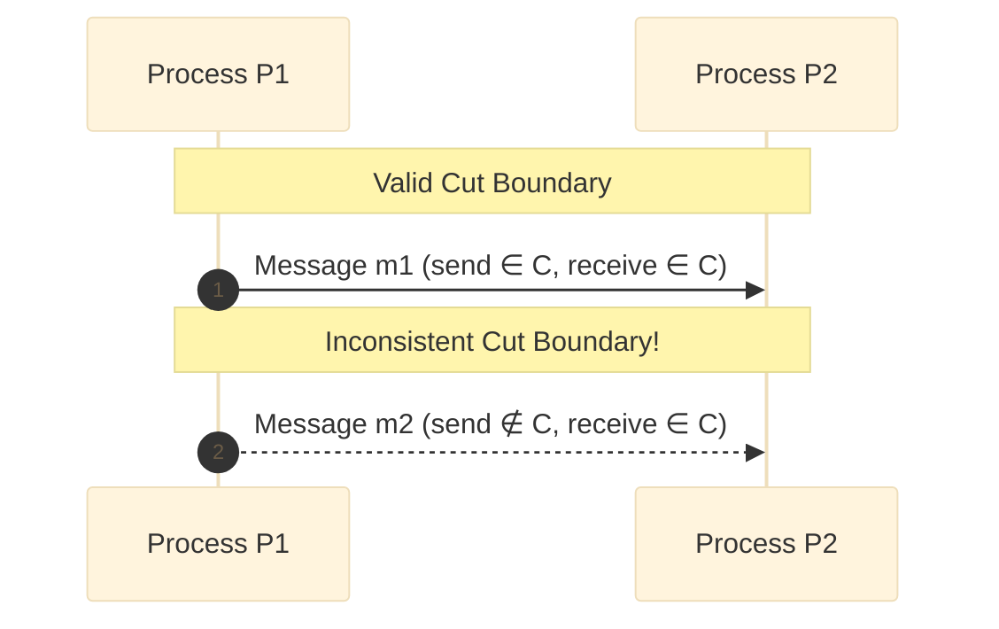
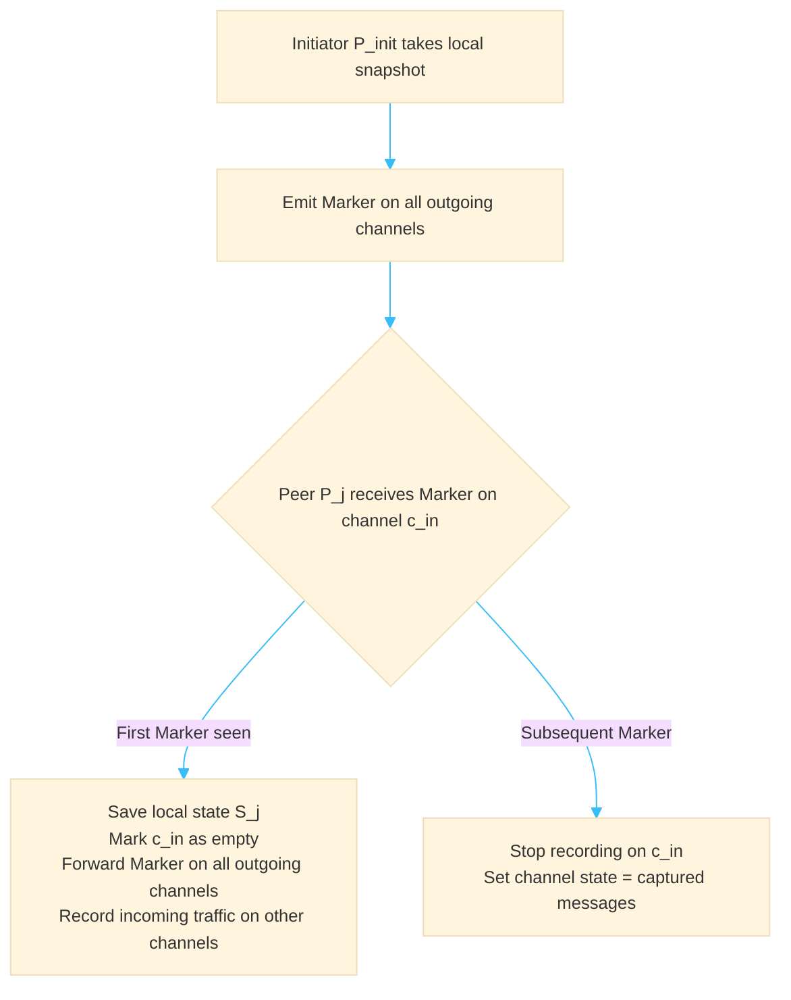

# Global Cuts and Consistent Snapshots

In distributed systems, understanding whether an observed global state could have genuinely occurred in reality requires formalizing the boundary of past observations: the **Cut**.

---

### Definition: Cut

A **Cut** $C$ is a subset of the global history of events across all processes:
$$C \subseteq \bigcup_{i=1}^n E_i$$

where $E_i = \{e_i^1, e_i^2, \dots\}$ represents the local event sequence of process $P_i$.

A cut is defined by choosing a local prefix for each process $P_i$. A **prefix** for process $P_i$ up to event $k$ is the ordered set of its first $k$ local events:
$$\text{Prefix}(P_i, k) = \{e_i^1, e_i^2, \dots, e_i^k\}$$

> [!abstract] Formal Definition of a Cut
> A cut $C$ is a collection of prefixes, one for each process:
> $$C = \bigcup_{i=1}^n \text{Prefix}(P_i, k_i)$$
> The state of the system along the frontier $(e_1^{k_1}, e_2^{k_2}, \dots, e_n^{k_n})$ defines the cut's snapshot.

---

### Consistent vs. Inconsistent Cuts

Because messages take non-zero time to traverse channels, naive cuts can record an effect without its cause.

#### The "Happened-Before" Relation ($\to$)
Formulated by Leslie Lamport, the causal ordering relation $\to$ defines the flow of information:
1. If $a$ and $b$ belong to the same process $P_i$ and $a$ occurs before $b$, then $a \to b$.
2. If $a = \text{send}(m)$ and $b = \text{receive}(m)$, then $a \to b$.
3. If $a \to b$ and $b \to c$, then $a \to c$ (transitivity).

> [!definition] Consistent Cut
> A cut $C$ is **consistent** if and only if it is closed under the causal relation "happened-before" ($\to$):
> $$\forall e, e' : (e \in C \;\land\; e' \to e) \implies e' \in C$$
> In words: *If an event belongs to the cut, all events that causally preceded it must also belong to the cut.*

#### Visualizing Inconsistency: The Orphan Message Paradox

A cut is **inconsistent** if it captures the receipt of a message without capturing its corresponding send event:
$$\text{receive}(m) \in C \quad \text{but} \quad \text{send}(m) \notin C$$

> [!danger] The Inconsistent State Danger
> 
> If $\text{receive}(m) \in C$ while $\text{send}(m) \notin C$, the cut reflects a state where a message was received out of thin air. This is an impossible global state that the real system never passed through, leading directly to [[Phantom Deadlocks]] and false safety alarms.

### In-Flight Messages and Channel State

A cut is not merely a set of local process states; it must also account for messages on the wire.

When a cut boundary splits the sending of a message from its receipt such that:

$$\text{send}(m) \in C \quad \text{and} \quad \text{receive}(m) \notin C$$

The message $m$ is not an orphan—it is an **in-flight (transit) message**.

> [!info] Complete Global Snapshot
> 
> A true global snapshot requires:
> 
> 1. A **Consistent Cut** of all process states: $S_i = \sigma(\text{Prefix}(P_i, k_i))$.
>     
> 2. The **Channel States** $\mathcal{C}_{i,j}$: The set of all messages sent by $P_i$ before its snapshot event $e_i^{k_i}$ but not yet delivered to $P_j$ before $P_j$'s snapshot event $e_j^{k_j}$:
>     
>     $$\mathcal{C}_{i,j} = \{ m \mid \text{send}_i(m) \in C \;\land\; \text{receive}_j(m) \notin C \}$$
>     

### The Chandy-Lamport Algorithm

The [[Chandy-Lamport-Algorithm]] records a consistent global state in a distributed system without pausing normal execution.

#### Assumptions

- **FIFO Channels:** Communication channels are directed, reliable, and preserve First-In, First-Out message order.
    
- **No Crashes:** Processes and channels do not fail during snapshot execution.
    
- **Strong Connectivity:** The network topology is strongly connected (every process can reach every other process).
    

#### Algorithm Execution

1. **Initiation:**
    - Any process $P_{\text{init}}$ can initiate the snapshot independently.
    - $P_{\text{init}}$ records its internal state $S_{\text{init}}$.
    - $P_{\text{init}}$ immediately emits a control message, called a **Marker**, along all its outgoing channels before sending any further application messages.
2. **Receiving a Marker on channel $c_{i,j}$:**
    - **Case 1: First time $P_j$ sees a Marker (from any channel):**
        - $P_j$ immediately records its own local state $S_j$.
        - $P_j$ records the state of incoming channel $c_{i,j}$ as **empty** ($\emptyset$).
        - $P_j$ broadcasts the **Marker** on all of its outgoing channels.
        - $P_j$ begins recording all incoming messages on all other incoming channels $c_{k,j}$ ($k \ne i$).
    - **Case 2: $P_j$ has already recorded its local state:**
        - $P_j$ stops recording incoming messages on channel $c_{i,j}$.
        - The state of channel $c_{i,j}$ is finalized as the sequence of all messages received on $c_{i,j}$ since $P_j$ recorded its state, up until this Marker arrived.

> [!tip] Why FIFO is Mandatory
> 
> The FIFO property ensures that the Marker acts as a physical boundary delimiter: no message sent _after_ the Marker can overtake it, and no message sent _before_ the Marker can arrive after it.

